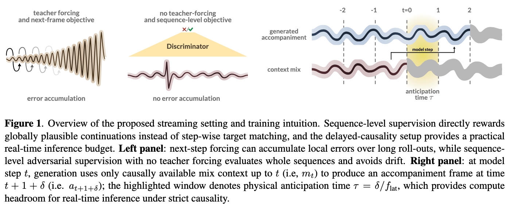
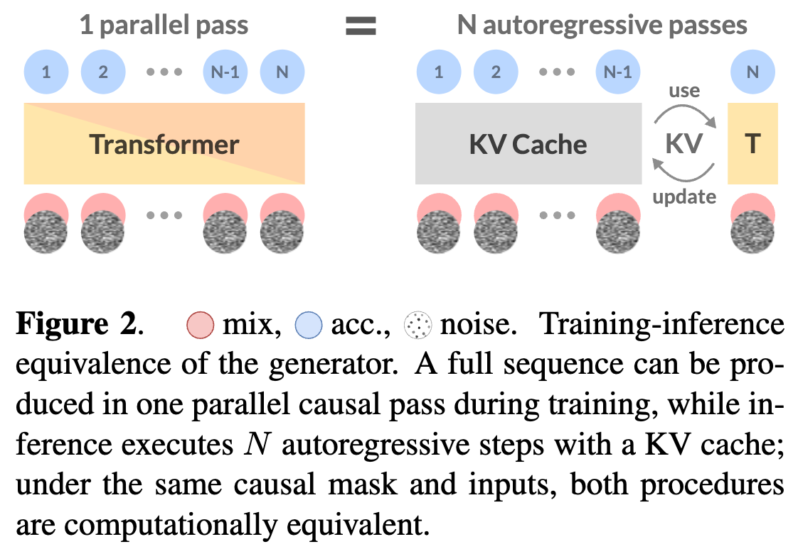

# LiveBand: Live Accompaniment Generation in the Audio Domain

**Abstract**  
We present LiveBand, a real-time system that generates high-fidelity music accompaniments to live audio input, respecting strict causal constraints. Our method trains a causal transformer generator in the continuous latent space of a pre-trained causal audio autoencoder, using adversarial sequence-level supervision from a discriminator. At each timestep, the generator receives only the causally available mix context and Gaussian noise, and predicts accompaniment latents without access to future mix frames or ground-truth target latents. Training is performed in a single parallel forward pass under causal masking, while streaming inference proceeds autoregressively with a rolling attention state. The model’s training and inference computations are matched by design, eliminating teacher forcing and the associated exposure bias. On a multi-instrument music accompaniment benchmark, LiveBand improves over prior work on objective measures of audio quality, beat alignment, and mix adherence, while enabling real-time streaming generation without lookahead into the future on consumer hardware.

## Framework

## Train-Test Equivalence

## Audio Examples
We highly recommend listening with headphones.
All examples use Slakh2100 test samples.

### Showcase: Internal LiveBand (0.1s)
We showcase some examples generated by the internal-data LiveBand model.
Note how the model produces accompaniments that are initially incoherent (the model already starts generating with absolutely no context about the incoming mix), and then quickly adapts once it has enough context about the mix.

<table class="demo-table">
  <tr>
    <th class="sample-col">Sample</th>
    <th>Input Mix</th>
    <th>Generated Stem</th>
    <th>Mix (L=Input, R=Gen)</th>
  </tr>
  <tr>
    <td class="sample-col">01</td>
    <td><audio src="audio/showcase/00480/input_mix.mp3" controls></audio></td>
    <td><audio src="audio/showcase/00480/gen_stem.mp3" controls></audio></td>
    <td><audio src="audio/showcase/00480/mix_lr.mp3" controls></audio></td>
  </tr>
  <tr>
    <td class="sample-col">02</td>
    <td><audio src="audio/showcase/00745/input_mix.mp3" controls></audio></td>
    <td><audio src="audio/showcase/00745/gen_stem.mp3" controls></audio></td>
    <td><audio src="audio/showcase/00745/mix_lr.mp3" controls></audio></td>
  </tr>
  <tr>
    <td class="sample-col">03</td>
    <td><audio src="audio/showcase/00780/input_mix.mp3" controls></audio></td>
    <td><audio src="audio/showcase/00780/gen_stem.mp3" controls></audio></td>
    <td><audio src="audio/showcase/00780/mix_lr.mp3" controls></audio></td>
  </tr>
  <tr>
    <td class="sample-col">04</td>
    <td><audio src="audio/showcase/00158/input_mix.mp3" controls></audio></td>
    <td><audio src="audio/showcase/00158/gen_stem.mp3" controls></audio></td>
    <td><audio src="audio/showcase/00158/mix_lr.mp3" controls></audio></td>
  </tr>
  <tr>
    <td class="sample-col">05</td>
    <td><audio src="audio/showcase/00426/input_mix.mp3" controls></audio></td>
    <td><audio src="audio/showcase/00426/gen_stem.mp3" controls></audio></td>
    <td><audio src="audio/showcase/00426/mix_lr.mp3" controls></audio></td>
  </tr>
  <tr>
    <td class="sample-col">06</td>
    <td><audio src="audio/showcase/00449/input_mix.mp3" controls></audio></td>
    <td><audio src="audio/showcase/00449/gen_stem.mp3" controls></audio></td>
    <td><audio src="audio/showcase/00449/mix_lr.mp3" controls></audio></td>
  </tr>
  <tr>
    <td class="sample-col">07</td>
    <td><audio src="audio/showcase/00477/input_mix.mp3" controls></audio></td>
    <td><audio src="audio/showcase/00477/gen_stem.mp3" controls></audio></td>
    <td><audio src="audio/showcase/00477/mix_lr.mp3" controls></audio></td>
  </tr>
  <tr>
    <td class="sample-col">08</td>
    <td><audio src="audio/showcase/00483/input_mix.mp3" controls></audio></td>
    <td><audio src="audio/showcase/00483/gen_stem.mp3" controls></audio></td>
    <td><audio src="audio/showcase/00483/mix_lr.mp3" controls></audio></td>
  </tr>
  <tr>
    <td class="sample-col">09</td>
    <td><audio src="audio/showcase/00865/input_mix.mp3" controls></audio></td>
    <td><audio src="audio/showcase/00865/gen_stem.mp3" controls></audio></td>
    <td><audio src="audio/showcase/00865/mix_lr.mp3" controls></audio></td>
  </tr>
  <tr>
    <td class="sample-col">10</td>
    <td><audio src="audio/showcase/00869/input_mix.mp3" controls></audio></td>
    <td><audio src="audio/showcase/00869/gen_stem.mp3" controls></audio></td>
    <td><audio src="audio/showcase/00869/mix_lr.mp3" controls></audio></td>
  </tr>
  <tr>
    <td class="sample-col">11</td>
    <td><audio src="audio/showcase/00434/input_mix.mp3" controls></audio></td>
    <td><audio src="audio/showcase/00434/gen_stem.mp3" controls></audio></td>
    <td><audio src="audio/showcase/00434/mix_lr.mp3" controls></audio></td>
  </tr>
  <tr>
    <td class="sample-col">12</td>
    <td><audio src="audio/showcase/00703/input_mix.mp3" controls></audio></td>
    <td><audio src="audio/showcase/00703/gen_stem.mp3" controls></audio></td>
    <td><audio src="audio/showcase/00703/mix_lr.mp3" controls></audio></td>
  </tr>
  <tr>
    <td class="sample-col">13</td>
    <td><audio src="audio/showcase/00108/input_mix.mp3" controls></audio></td>
    <td><audio src="audio/showcase/00108/gen_stem.mp3" controls></audio></td>
    <td><audio src="audio/showcase/00108/mix_lr.mp3" controls></audio></td>
  </tr>
  <tr>
    <td class="sample-col">14</td>
    <td><audio src="audio/showcase/00419/input_mix.mp3" controls></audio></td>
    <td><audio src="audio/showcase/00419/gen_stem.mp3" controls></audio></td>
    <td><audio src="audio/showcase/00419/mix_lr.mp3" controls></audio></td>
  </tr>
  <tr>
    <td class="sample-col">15</td>
    <td><audio src="audio/showcase/00041/input_mix.mp3" controls></audio></td>
    <td><audio src="audio/showcase/00041/gen_stem.mp3" controls></audio></td>
    <td><audio src="audio/showcase/00041/mix_lr.mp3" controls></audio></td>
  </tr>
  <tr>
    <td class="sample-col">16</td>
    <td><audio src="audio/showcase/00460/input_mix.mp3" controls></audio></td>
    <td><audio src="audio/showcase/00460/gen_stem.mp3" controls></audio></td>
    <td><audio src="audio/showcase/00460/mix_lr.mp3" controls></audio></td>
  </tr>
  <tr>
    <td class="sample-col">17</td>
    <td><audio src="audio/showcase/00625/input_mix.mp3" controls></audio></td>
    <td><audio src="audio/showcase/00625/gen_stem.mp3" controls></audio></td>
    <td><audio src="audio/showcase/00625/mix_lr.mp3" controls></audio></td>
  </tr>
  <tr>
    <td class="sample-col">18</td>
    <td><audio src="audio/showcase/00134/input_mix.mp3" controls></audio></td>
    <td><audio src="audio/showcase/00134/gen_stem.mp3" controls></audio></td>
    <td><audio src="audio/showcase/00134/mix_lr.mp3" controls></audio></td>
  </tr>
  <tr>
    <td class="sample-col">19</td>
    <td><audio src="audio/showcase/00479/input_mix.mp3" controls></audio></td>
    <td><audio src="audio/showcase/00479/gen_stem.mp3" controls></audio></td>
    <td><audio src="audio/showcase/00479/mix_lr.mp3" controls></audio></td>
  </tr>
  <tr>
    <td class="sample-col">20</td>
    <td><audio src="audio/showcase/00027/input_mix.mp3" controls></audio></td>
    <td><audio src="audio/showcase/00027/gen_stem.mp3" controls></audio></td>
    <td><audio src="audio/showcase/00027/mix_lr.mp3" controls></audio></td>
  </tr>
  <tr>
    <td class="sample-col">21</td>
    <td><audio src="audio/showcase/00934/input_mix.mp3" controls></audio></td>
    <td><audio src="audio/showcase/00934/gen_stem.mp3" controls></audio></td>
    <td><audio src="audio/showcase/00934/mix_lr.mp3" controls></audio></td>
  </tr>
  <tr>
    <td class="sample-col">22</td>
    <td><audio src="audio/showcase/00923/input_mix.mp3" controls></audio></td>
    <td><audio src="audio/showcase/00923/gen_stem.mp3" controls></audio></td>
    <td><audio src="audio/showcase/00923/mix_lr.mp3" controls></audio></td>
  </tr>
  <tr>
    <td class="sample-col">23</td>
    <td><audio src="audio/showcase/00738/input_mix.mp3" controls></audio></td>
    <td><audio src="audio/showcase/00738/gen_stem.mp3" controls></audio></td>
    <td><audio src="audio/showcase/00738/mix_lr.mp3" controls></audio></td>
  </tr>
  <tr>
    <td class="sample-col">24</td>
    <td><audio src="audio/showcase/00612/input_mix.mp3" controls></audio></td>
    <td><audio src="audio/showcase/00612/gen_stem.mp3" controls></audio></td>
    <td><audio src="audio/showcase/00612/mix_lr.mp3" controls></audio></td>
  </tr>
  <tr>
    <td class="sample-col">25</td>
    <td><audio src="audio/showcase/00502/input_mix.mp3" controls></audio></td>
    <td><audio src="audio/showcase/00502/gen_stem.mp3" controls></audio></td>
    <td><audio src="audio/showcase/00502/mix_lr.mp3" controls></audio></td>
  </tr>
</table>

### LiveBand Family Comparison
We compare the internal LiveBand model (0.1s anticipation) with Slakh2100-trained models at 0s, 0.1s, 1s, and the bidirectional variant. The bidirectional model outputs 10s, while all other samples are 20s.

<table class="demo-table">
  <tr>
    <th colspan="7">Sample 01</th>
  </tr>
  <tr>
    <th>Input Mix</th>
    <th>GT Stem</th>
    <th>GT Mix (L=Input, R=GT)</th>
    <th>Internal (0.1s) Gen</th>
    <th>Internal Mix</th>
    <th>LiveBand 0s Gen</th>
    <th>LiveBand 0s Mix</th>
  </tr>
  <tr>
    <td><audio src="audio/liveband_comparison/00119/input_mix.mp3" controls></audio></td>
    <td><audio src="audio/liveband_comparison/00119/gt_stem.mp3" controls></audio></td>
    <td><audio src="audio/liveband_comparison/00119/gt_mix_lr.mp3" controls></audio></td>
    <td><audio src="audio/liveband_comparison/00119/internal_gen.mp3" controls></audio></td>
    <td><audio src="audio/liveband_comparison/00119/internal_mix_lr.mp3" controls></audio></td>
    <td><audio src="audio/liveband_comparison/00119/lb0_gen.mp3" controls></audio></td>
    <td><audio src="audio/liveband_comparison/00119/lb0_mix_lr.mp3" controls></audio></td>
  </tr>
  <tr>
    <th>LiveBand 0.1s Gen</th>
    <th>LiveBand 0.1s Mix</th>
    <th>LiveBand 1s Gen</th>
    <th>LiveBand 1s Mix</th>
    <th>LiveBand Bidir Gen</th>
    <th>LiveBand Bidir Mix</th>
    <th class="empty-cell"></th>
  </tr>
  <tr>
    <td><audio src="audio/liveband_comparison/00119/lb01_gen.mp3" controls></audio></td>
    <td><audio src="audio/liveband_comparison/00119/lb01_mix_lr.mp3" controls></audio></td>
    <td><audio src="audio/liveband_comparison/00119/lb1_gen.mp3" controls></audio></td>
    <td><audio src="audio/liveband_comparison/00119/lb1_mix_lr.mp3" controls></audio></td>
    <td><audio src="audio/liveband_comparison/00119/lbbidir_gen.mp3" controls></audio></td>
    <td><audio src="audio/liveband_comparison/00119/lbbidir_mix_lr.mp3" controls></audio></td>
    <td class="empty-cell"></td>
  </tr>
  <tr>
    <td colspan="7" style="height: 16px;"></td>
  </tr>
  <tr>
    <th colspan="7">Sample 02</th>
  </tr>
  <tr>
    <th>Input Mix</th>
    <th>GT Stem</th>
    <th>GT Mix (L=Input, R=GT)</th>
    <th>Internal (0.1s) Gen</th>
    <th>Internal Mix</th>
    <th>LiveBand 0s Gen</th>
    <th>LiveBand 0s Mix</th>
  </tr>
  <tr>
    <td><audio src="audio/liveband_comparison/00486/input_mix.mp3" controls></audio></td>
    <td><audio src="audio/liveband_comparison/00486/gt_stem.mp3" controls></audio></td>
    <td><audio src="audio/liveband_comparison/00486/gt_mix_lr.mp3" controls></audio></td>
    <td><audio src="audio/liveband_comparison/00486/internal_gen.mp3" controls></audio></td>
    <td><audio src="audio/liveband_comparison/00486/internal_mix_lr.mp3" controls></audio></td>
    <td><audio src="audio/liveband_comparison/00486/lb0_gen.mp3" controls></audio></td>
    <td><audio src="audio/liveband_comparison/00486/lb0_mix_lr.mp3" controls></audio></td>
  </tr>
  <tr>
    <th>LiveBand 0.1s Gen</th>
    <th>LiveBand 0.1s Mix</th>
    <th>LiveBand 1s Gen</th>
    <th>LiveBand 1s Mix</th>
    <th>LiveBand Bidir Gen</th>
    <th>LiveBand Bidir Mix</th>
    <th class="empty-cell"></th>
  </tr>
  <tr>
    <td><audio src="audio/liveband_comparison/00486/lb01_gen.mp3" controls></audio></td>
    <td><audio src="audio/liveband_comparison/00486/lb01_mix_lr.mp3" controls></audio></td>
    <td><audio src="audio/liveband_comparison/00486/lb1_gen.mp3" controls></audio></td>
    <td><audio src="audio/liveband_comparison/00486/lb1_mix_lr.mp3" controls></audio></td>
    <td><audio src="audio/liveband_comparison/00486/lbbidir_gen.mp3" controls></audio></td>
    <td><audio src="audio/liveband_comparison/00486/lbbidir_mix_lr.mp3" controls></audio></td>
    <td class="empty-cell"></td>
  </tr>
  <tr>
    <td colspan="7" style="height: 16px;"></td>
  </tr>
  <tr>
    <th colspan="7">Sample 03</th>
  </tr>
  <tr>
    <th>Input Mix</th>
    <th>GT Stem</th>
    <th>GT Mix (L=Input, R=GT)</th>
    <th>Internal (0.1s) Gen</th>
    <th>Internal Mix</th>
    <th>LiveBand 0s Gen</th>
    <th>LiveBand 0s Mix</th>
  </tr>
  <tr>
    <td><audio src="audio/liveband_comparison/00369/input_mix.mp3" controls></audio></td>
    <td><audio src="audio/liveband_comparison/00369/gt_stem.mp3" controls></audio></td>
    <td><audio src="audio/liveband_comparison/00369/gt_mix_lr.mp3" controls></audio></td>
    <td><audio src="audio/liveband_comparison/00369/internal_gen.mp3" controls></audio></td>
    <td><audio src="audio/liveband_comparison/00369/internal_mix_lr.mp3" controls></audio></td>
    <td><audio src="audio/liveband_comparison/00369/lb0_gen.mp3" controls></audio></td>
    <td><audio src="audio/liveband_comparison/00369/lb0_mix_lr.mp3" controls></audio></td>
  </tr>
  <tr>
    <th>LiveBand 0.1s Gen</th>
    <th>LiveBand 0.1s Mix</th>
    <th>LiveBand 1s Gen</th>
    <th>LiveBand 1s Mix</th>
    <th>LiveBand Bidir Gen</th>
    <th>LiveBand Bidir Mix</th>
    <th class="empty-cell"></th>
  </tr>
  <tr>
    <td><audio src="audio/liveband_comparison/00369/lb01_gen.mp3" controls></audio></td>
    <td><audio src="audio/liveband_comparison/00369/lb01_mix_lr.mp3" controls></audio></td>
    <td><audio src="audio/liveband_comparison/00369/lb1_gen.mp3" controls></audio></td>
    <td><audio src="audio/liveband_comparison/00369/lb1_mix_lr.mp3" controls></audio></td>
    <td><audio src="audio/liveband_comparison/00369/lbbidir_gen.mp3" controls></audio></td>
    <td><audio src="audio/liveband_comparison/00369/lbbidir_mix_lr.mp3" controls></audio></td>
    <td class="empty-cell"></td>
  </tr>
  <tr>
    <td colspan="7" style="height: 16px;"></td>
  </tr>
  <tr>
    <th colspan="7">Sample 04</th>
  </tr>
  <tr>
    <th>Input Mix</th>
    <th>GT Stem</th>
    <th>GT Mix (L=Input, R=GT)</th>
    <th>Internal (0.1s) Gen</th>
    <th>Internal Mix</th>
    <th>LiveBand 0s Gen</th>
    <th>LiveBand 0s Mix</th>
  </tr>
  <tr>
    <td><audio src="audio/liveband_comparison/00781/input_mix.mp3" controls></audio></td>
    <td><audio src="audio/liveband_comparison/00781/gt_stem.mp3" controls></audio></td>
    <td><audio src="audio/liveband_comparison/00781/gt_mix_lr.mp3" controls></audio></td>
    <td><audio src="audio/liveband_comparison/00781/internal_gen.mp3" controls></audio></td>
    <td><audio src="audio/liveband_comparison/00781/internal_mix_lr.mp3" controls></audio></td>
    <td><audio src="audio/liveband_comparison/00781/lb0_gen.mp3" controls></audio></td>
    <td><audio src="audio/liveband_comparison/00781/lb0_mix_lr.mp3" controls></audio></td>
  </tr>
  <tr>
    <th>LiveBand 0.1s Gen</th>
    <th>LiveBand 0.1s Mix</th>
    <th>LiveBand 1s Gen</th>
    <th>LiveBand 1s Mix</th>
    <th>LiveBand Bidir Gen</th>
    <th>LiveBand Bidir Mix</th>
    <th class="empty-cell"></th>
  </tr>
  <tr>
    <td><audio src="audio/liveband_comparison/00781/lb01_gen.mp3" controls></audio></td>
    <td><audio src="audio/liveband_comparison/00781/lb01_mix_lr.mp3" controls></audio></td>
    <td><audio src="audio/liveband_comparison/00781/lb1_gen.mp3" controls></audio></td>
    <td><audio src="audio/liveband_comparison/00781/lb1_mix_lr.mp3" controls></audio></td>
    <td><audio src="audio/liveband_comparison/00781/lbbidir_gen.mp3" controls></audio></td>
    <td><audio src="audio/liveband_comparison/00781/lbbidir_mix_lr.mp3" controls></audio></td>
    <td class="empty-cell"></td>
  </tr>
  <tr>
    <td colspan="7" style="height: 16px;"></td>
  </tr>
  <tr>
    <th colspan="7">Sample 05</th>
  </tr>
  <tr>
    <th>Input Mix</th>
    <th>GT Stem</th>
    <th>GT Mix (L=Input, R=GT)</th>
    <th>Internal (0.1s) Gen</th>
    <th>Internal Mix</th>
    <th>LiveBand 0s Gen</th>
    <th>LiveBand 0s Mix</th>
  </tr>
  <tr>
    <td><audio src="audio/liveband_comparison/00293/input_mix.mp3" controls></audio></td>
    <td><audio src="audio/liveband_comparison/00293/gt_stem.mp3" controls></audio></td>
    <td><audio src="audio/liveband_comparison/00293/gt_mix_lr.mp3" controls></audio></td>
    <td><audio src="audio/liveband_comparison/00293/internal_gen.mp3" controls></audio></td>
    <td><audio src="audio/liveband_comparison/00293/internal_mix_lr.mp3" controls></audio></td>
    <td><audio src="audio/liveband_comparison/00293/lb0_gen.mp3" controls></audio></td>
    <td><audio src="audio/liveband_comparison/00293/lb0_mix_lr.mp3" controls></audio></td>
  </tr>
  <tr>
    <th>LiveBand 0.1s Gen</th>
    <th>LiveBand 0.1s Mix</th>
    <th>LiveBand 1s Gen</th>
    <th>LiveBand 1s Mix</th>
    <th>LiveBand Bidir Gen</th>
    <th>LiveBand Bidir Mix</th>
    <th class="empty-cell"></th>
  </tr>
  <tr>
    <td><audio src="audio/liveband_comparison/00293/lb01_gen.mp3" controls></audio></td>
    <td><audio src="audio/liveband_comparison/00293/lb01_mix_lr.mp3" controls></audio></td>
    <td><audio src="audio/liveband_comparison/00293/lb1_gen.mp3" controls></audio></td>
    <td><audio src="audio/liveband_comparison/00293/lb1_mix_lr.mp3" controls></audio></td>
    <td><audio src="audio/liveband_comparison/00293/lbbidir_gen.mp3" controls></audio></td>
    <td><audio src="audio/liveband_comparison/00293/lbbidir_mix_lr.mp3" controls></audio></td>
    <td class="empty-cell"></td>
  </tr>
  <tr>
    <td colspan="7" style="height: 16px;"></td>
  </tr>
  <tr>
    <th colspan="7">Sample 06</th>
  </tr>
  <tr>
    <th>Input Mix</th>
    <th>GT Stem</th>
    <th>GT Mix (L=Input, R=GT)</th>
    <th>Internal (0.1s) Gen</th>
    <th>Internal Mix</th>
    <th>LiveBand 0s Gen</th>
    <th>LiveBand 0s Mix</th>
  </tr>
  <tr>
    <td><audio src="audio/liveband_comparison/00142/input_mix.mp3" controls></audio></td>
    <td><audio src="audio/liveband_comparison/00142/gt_stem.mp3" controls></audio></td>
    <td><audio src="audio/liveband_comparison/00142/gt_mix_lr.mp3" controls></audio></td>
    <td><audio src="audio/liveband_comparison/00142/internal_gen.mp3" controls></audio></td>
    <td><audio src="audio/liveband_comparison/00142/internal_mix_lr.mp3" controls></audio></td>
    <td><audio src="audio/liveband_comparison/00142/lb0_gen.mp3" controls></audio></td>
    <td><audio src="audio/liveband_comparison/00142/lb0_mix_lr.mp3" controls></audio></td>
  </tr>
  <tr>
    <th>LiveBand 0.1s Gen</th>
    <th>LiveBand 0.1s Mix</th>
    <th>LiveBand 1s Gen</th>
    <th>LiveBand 1s Mix</th>
    <th>LiveBand Bidir Gen</th>
    <th>LiveBand Bidir Mix</th>
    <th class="empty-cell"></th>
  </tr>
  <tr>
    <td><audio src="audio/liveband_comparison/00142/lb01_gen.mp3" controls></audio></td>
    <td><audio src="audio/liveband_comparison/00142/lb01_mix_lr.mp3" controls></audio></td>
    <td><audio src="audio/liveband_comparison/00142/lb1_gen.mp3" controls></audio></td>
    <td><audio src="audio/liveband_comparison/00142/lb1_mix_lr.mp3" controls></audio></td>
    <td><audio src="audio/liveband_comparison/00142/lbbidir_gen.mp3" controls></audio></td>
    <td><audio src="audio/liveband_comparison/00142/lbbidir_mix_lr.mp3" controls></audio></td>
    <td class="empty-cell"></td>
  </tr>
  <tr>
    <td colspan="7" style="height: 16px;"></td>
  </tr>
  <tr>
    <th colspan="7">Sample 07</th>
  </tr>
  <tr>
    <th>Input Mix</th>
    <th>GT Stem</th>
    <th>GT Mix (L=Input, R=GT)</th>
    <th>Internal (0.1s) Gen</th>
    <th>Internal Mix</th>
    <th>LiveBand 0s Gen</th>
    <th>LiveBand 0s Mix</th>
  </tr>
  <tr>
    <td><audio src="audio/liveband_comparison/00095/input_mix.mp3" controls></audio></td>
    <td><audio src="audio/liveband_comparison/00095/gt_stem.mp3" controls></audio></td>
    <td><audio src="audio/liveband_comparison/00095/gt_mix_lr.mp3" controls></audio></td>
    <td><audio src="audio/liveband_comparison/00095/internal_gen.mp3" controls></audio></td>
    <td><audio src="audio/liveband_comparison/00095/internal_mix_lr.mp3" controls></audio></td>
    <td><audio src="audio/liveband_comparison/00095/lb0_gen.mp3" controls></audio></td>
    <td><audio src="audio/liveband_comparison/00095/lb0_mix_lr.mp3" controls></audio></td>
  </tr>
  <tr>
    <th>LiveBand 0.1s Gen</th>
    <th>LiveBand 0.1s Mix</th>
    <th>LiveBand 1s Gen</th>
    <th>LiveBand 1s Mix</th>
    <th>LiveBand Bidir Gen</th>
    <th>LiveBand Bidir Mix</th>
    <th class="empty-cell"></th>
  </tr>
  <tr>
    <td><audio src="audio/liveband_comparison/00095/lb01_gen.mp3" controls></audio></td>
    <td><audio src="audio/liveband_comparison/00095/lb01_mix_lr.mp3" controls></audio></td>
    <td><audio src="audio/liveband_comparison/00095/lb1_gen.mp3" controls></audio></td>
    <td><audio src="audio/liveband_comparison/00095/lb1_mix_lr.mp3" controls></audio></td>
    <td><audio src="audio/liveband_comparison/00095/lbbidir_gen.mp3" controls></audio></td>
    <td><audio src="audio/liveband_comparison/00095/lbbidir_mix_lr.mp3" controls></audio></td>
    <td class="empty-cell"></td>
  </tr>
  <tr>
    <td colspan="7" style="height: 16px;"></td>
  </tr>
  <tr>
    <th colspan="7">Sample 08</th>
  </tr>
  <tr>
    <th>Input Mix</th>
    <th>GT Stem</th>
    <th>GT Mix (L=Input, R=GT)</th>
    <th>Internal (0.1s) Gen</th>
    <th>Internal Mix</th>
    <th>LiveBand 0s Gen</th>
    <th>LiveBand 0s Mix</th>
  </tr>
  <tr>
    <td><audio src="audio/liveband_comparison/00760/input_mix.mp3" controls></audio></td>
    <td><audio src="audio/liveband_comparison/00760/gt_stem.mp3" controls></audio></td>
    <td><audio src="audio/liveband_comparison/00760/gt_mix_lr.mp3" controls></audio></td>
    <td><audio src="audio/liveband_comparison/00760/internal_gen.mp3" controls></audio></td>
    <td><audio src="audio/liveband_comparison/00760/internal_mix_lr.mp3" controls></audio></td>
    <td><audio src="audio/liveband_comparison/00760/lb0_gen.mp3" controls></audio></td>
    <td><audio src="audio/liveband_comparison/00760/lb0_mix_lr.mp3" controls></audio></td>
  </tr>
  <tr>
    <th>LiveBand 0.1s Gen</th>
    <th>LiveBand 0.1s Mix</th>
    <th>LiveBand 1s Gen</th>
    <th>LiveBand 1s Mix</th>
    <th>LiveBand Bidir Gen</th>
    <th>LiveBand Bidir Mix</th>
    <th class="empty-cell"></th>
  </tr>
  <tr>
    <td><audio src="audio/liveband_comparison/00760/lb01_gen.mp3" controls></audio></td>
    <td><audio src="audio/liveband_comparison/00760/lb01_mix_lr.mp3" controls></audio></td>
    <td><audio src="audio/liveband_comparison/00760/lb1_gen.mp3" controls></audio></td>
    <td><audio src="audio/liveband_comparison/00760/lb1_mix_lr.mp3" controls></audio></td>
    <td><audio src="audio/liveband_comparison/00760/lbbidir_gen.mp3" controls></audio></td>
    <td><audio src="audio/liveband_comparison/00760/lbbidir_mix_lr.mp3" controls></audio></td>
    <td class="empty-cell"></td>
  </tr>
  <tr>
    <td colspan="7" style="height: 16px;"></td>
  </tr>
  <tr>
    <th colspan="7">Sample 09</th>
  </tr>
  <tr>
    <th>Input Mix</th>
    <th>GT Stem</th>
    <th>GT Mix (L=Input, R=GT)</th>
    <th>Internal (0.1s) Gen</th>
    <th>Internal Mix</th>
    <th>LiveBand 0s Gen</th>
    <th>LiveBand 0s Mix</th>
  </tr>
  <tr>
    <td><audio src="audio/liveband_comparison/00429/input_mix.mp3" controls></audio></td>
    <td><audio src="audio/liveband_comparison/00429/gt_stem.mp3" controls></audio></td>
    <td><audio src="audio/liveband_comparison/00429/gt_mix_lr.mp3" controls></audio></td>
    <td><audio src="audio/liveband_comparison/00429/internal_gen.mp3" controls></audio></td>
    <td><audio src="audio/liveband_comparison/00429/internal_mix_lr.mp3" controls></audio></td>
    <td><audio src="audio/liveband_comparison/00429/lb0_gen.mp3" controls></audio></td>
    <td><audio src="audio/liveband_comparison/00429/lb0_mix_lr.mp3" controls></audio></td>
  </tr>
  <tr>
    <th>LiveBand 0.1s Gen</th>
    <th>LiveBand 0.1s Mix</th>
    <th>LiveBand 1s Gen</th>
    <th>LiveBand 1s Mix</th>
    <th>LiveBand Bidir Gen</th>
    <th>LiveBand Bidir Mix</th>
    <th class="empty-cell"></th>
  </tr>
  <tr>
    <td><audio src="audio/liveband_comparison/00429/lb01_gen.mp3" controls></audio></td>
    <td><audio src="audio/liveband_comparison/00429/lb01_mix_lr.mp3" controls></audio></td>
    <td><audio src="audio/liveband_comparison/00429/lb1_gen.mp3" controls></audio></td>
    <td><audio src="audio/liveband_comparison/00429/lb1_mix_lr.mp3" controls></audio></td>
    <td><audio src="audio/liveband_comparison/00429/lbbidir_gen.mp3" controls></audio></td>
    <td><audio src="audio/liveband_comparison/00429/lbbidir_mix_lr.mp3" controls></audio></td>
    <td class="empty-cell"></td>
  </tr>
  <tr>
    <td colspan="7" style="height: 16px;"></td>
  </tr>
  <tr>
    <th colspan="7">Sample 10</th>
  </tr>
  <tr>
    <th>Input Mix</th>
    <th>GT Stem</th>
    <th>GT Mix (L=Input, R=GT)</th>
    <th>Internal (0.1s) Gen</th>
    <th>Internal Mix</th>
    <th>LiveBand 0s Gen</th>
    <th>LiveBand 0s Mix</th>
  </tr>
  <tr>
    <td><audio src="audio/liveband_comparison/00220/input_mix.mp3" controls></audio></td>
    <td><audio src="audio/liveband_comparison/00220/gt_stem.mp3" controls></audio></td>
    <td><audio src="audio/liveband_comparison/00220/gt_mix_lr.mp3" controls></audio></td>
    <td><audio src="audio/liveband_comparison/00220/internal_gen.mp3" controls></audio></td>
    <td><audio src="audio/liveband_comparison/00220/internal_mix_lr.mp3" controls></audio></td>
    <td><audio src="audio/liveband_comparison/00220/lb0_gen.mp3" controls></audio></td>
    <td><audio src="audio/liveband_comparison/00220/lb0_mix_lr.mp3" controls></audio></td>
  </tr>
  <tr>
    <th>LiveBand 0.1s Gen</th>
    <th>LiveBand 0.1s Mix</th>
    <th>LiveBand 1s Gen</th>
    <th>LiveBand 1s Mix</th>
    <th>LiveBand Bidir Gen</th>
    <th>LiveBand Bidir Mix</th>
    <th class="empty-cell"></th>
  </tr>
  <tr>
    <td><audio src="audio/liveband_comparison/00220/lb01_gen.mp3" controls></audio></td>
    <td><audio src="audio/liveband_comparison/00220/lb01_mix_lr.mp3" controls></audio></td>
    <td><audio src="audio/liveband_comparison/00220/lb1_gen.mp3" controls></audio></td>
    <td><audio src="audio/liveband_comparison/00220/lb1_mix_lr.mp3" controls></audio></td>
    <td><audio src="audio/liveband_comparison/00220/lbbidir_gen.mp3" controls></audio></td>
    <td><audio src="audio/liveband_comparison/00220/lbbidir_mix_lr.mp3" controls></audio></td>
    <td class="empty-cell"></td>
  </tr>
  <tr>
    <td colspan="7" style="height: 16px;"></td>
  </tr>
  <tr>
    <th colspan="7">Sample 11</th>
  </tr>
  <tr>
    <th>Input Mix</th>
    <th>GT Stem</th>
    <th>GT Mix (L=Input, R=GT)</th>
    <th>Internal (0.1s) Gen</th>
    <th>Internal Mix</th>
    <th>LiveBand 0s Gen</th>
    <th>LiveBand 0s Mix</th>
  </tr>
  <tr>
    <td><audio src="audio/liveband_comparison/00058/input_mix.mp3" controls></audio></td>
    <td><audio src="audio/liveband_comparison/00058/gt_stem.mp3" controls></audio></td>
    <td><audio src="audio/liveband_comparison/00058/gt_mix_lr.mp3" controls></audio></td>
    <td><audio src="audio/liveband_comparison/00058/internal_gen.mp3" controls></audio></td>
    <td><audio src="audio/liveband_comparison/00058/internal_mix_lr.mp3" controls></audio></td>
    <td><audio src="audio/liveband_comparison/00058/lb0_gen.mp3" controls></audio></td>
    <td><audio src="audio/liveband_comparison/00058/lb0_mix_lr.mp3" controls></audio></td>
  </tr>
  <tr>
    <th>LiveBand 0.1s Gen</th>
    <th>LiveBand 0.1s Mix</th>
    <th>LiveBand 1s Gen</th>
    <th>LiveBand 1s Mix</th>
    <th>LiveBand Bidir Gen</th>
    <th>LiveBand Bidir Mix</th>
    <th class="empty-cell"></th>
  </tr>
  <tr>
    <td><audio src="audio/liveband_comparison/00058/lb01_gen.mp3" controls></audio></td>
    <td><audio src="audio/liveband_comparison/00058/lb01_mix_lr.mp3" controls></audio></td>
    <td><audio src="audio/liveband_comparison/00058/lb1_gen.mp3" controls></audio></td>
    <td><audio src="audio/liveband_comparison/00058/lb1_mix_lr.mp3" controls></audio></td>
    <td><audio src="audio/liveband_comparison/00058/lbbidir_gen.mp3" controls></audio></td>
    <td><audio src="audio/liveband_comparison/00058/lbbidir_mix_lr.mp3" controls></audio></td>
    <td class="empty-cell"></td>
  </tr>
  <tr>
    <td colspan="7" style="height: 16px;"></td>
  </tr>
  <tr>
    <th colspan="7">Sample 12</th>
  </tr>
  <tr>
    <th>Input Mix</th>
    <th>GT Stem</th>
    <th>GT Mix (L=Input, R=GT)</th>
    <th>Internal (0.1s) Gen</th>
    <th>Internal Mix</th>
    <th>LiveBand 0s Gen</th>
    <th>LiveBand 0s Mix</th>
  </tr>
  <tr>
    <td><audio src="audio/liveband_comparison/00669/input_mix.mp3" controls></audio></td>
    <td><audio src="audio/liveband_comparison/00669/gt_stem.mp3" controls></audio></td>
    <td><audio src="audio/liveband_comparison/00669/gt_mix_lr.mp3" controls></audio></td>
    <td><audio src="audio/liveband_comparison/00669/internal_gen.mp3" controls></audio></td>
    <td><audio src="audio/liveband_comparison/00669/internal_mix_lr.mp3" controls></audio></td>
    <td><audio src="audio/liveband_comparison/00669/lb0_gen.mp3" controls></audio></td>
    <td><audio src="audio/liveband_comparison/00669/lb0_mix_lr.mp3" controls></audio></td>
  </tr>
  <tr>
    <th>LiveBand 0.1s Gen</th>
    <th>LiveBand 0.1s Mix</th>
    <th>LiveBand 1s Gen</th>
    <th>LiveBand 1s Mix</th>
    <th>LiveBand Bidir Gen</th>
    <th>LiveBand Bidir Mix</th>
    <th class="empty-cell"></th>
  </tr>
  <tr>
    <td><audio src="audio/liveband_comparison/00669/lb01_gen.mp3" controls></audio></td>
    <td><audio src="audio/liveband_comparison/00669/lb01_mix_lr.mp3" controls></audio></td>
    <td><audio src="audio/liveband_comparison/00669/lb1_gen.mp3" controls></audio></td>
    <td><audio src="audio/liveband_comparison/00669/lb1_mix_lr.mp3" controls></audio></td>
    <td><audio src="audio/liveband_comparison/00669/lbbidir_gen.mp3" controls></audio></td>
    <td><audio src="audio/liveband_comparison/00669/lbbidir_mix_lr.mp3" controls></audio></td>
    <td class="empty-cell"></td>
  </tr>
  <tr>
    <td colspan="7" style="height: 16px;"></td>
  </tr>
  <tr>
    <th colspan="7">Sample 13</th>
  </tr>
  <tr>
    <th>Input Mix</th>
    <th>GT Stem</th>
    <th>GT Mix (L=Input, R=GT)</th>
    <th>Internal (0.1s) Gen</th>
    <th>Internal Mix</th>
    <th>LiveBand 0s Gen</th>
    <th>LiveBand 0s Mix</th>
  </tr>
  <tr>
    <td><audio src="audio/liveband_comparison/00641/input_mix.mp3" controls></audio></td>
    <td><audio src="audio/liveband_comparison/00641/gt_stem.mp3" controls></audio></td>
    <td><audio src="audio/liveband_comparison/00641/gt_mix_lr.mp3" controls></audio></td>
    <td><audio src="audio/liveband_comparison/00641/internal_gen.mp3" controls></audio></td>
    <td><audio src="audio/liveband_comparison/00641/internal_mix_lr.mp3" controls></audio></td>
    <td><audio src="audio/liveband_comparison/00641/lb0_gen.mp3" controls></audio></td>
    <td><audio src="audio/liveband_comparison/00641/lb0_mix_lr.mp3" controls></audio></td>
  </tr>
  <tr>
    <th>LiveBand 0.1s Gen</th>
    <th>LiveBand 0.1s Mix</th>
    <th>LiveBand 1s Gen</th>
    <th>LiveBand 1s Mix</th>
    <th>LiveBand Bidir Gen</th>
    <th>LiveBand Bidir Mix</th>
    <th class="empty-cell"></th>
  </tr>
  <tr>
    <td><audio src="audio/liveband_comparison/00641/lb01_gen.mp3" controls></audio></td>
    <td><audio src="audio/liveband_comparison/00641/lb01_mix_lr.mp3" controls></audio></td>
    <td><audio src="audio/liveband_comparison/00641/lb1_gen.mp3" controls></audio></td>
    <td><audio src="audio/liveband_comparison/00641/lb1_mix_lr.mp3" controls></audio></td>
    <td><audio src="audio/liveband_comparison/00641/lbbidir_gen.mp3" controls></audio></td>
    <td><audio src="audio/liveband_comparison/00641/lbbidir_mix_lr.mp3" controls></audio></td>
    <td class="empty-cell"></td>
  </tr>
  <tr>
    <td colspan="7" style="height: 16px;"></td>
  </tr>
  <tr>
    <th colspan="7">Sample 14</th>
  </tr>
  <tr>
    <th>Input Mix</th>
    <th>GT Stem</th>
    <th>GT Mix (L=Input, R=GT)</th>
    <th>Internal (0.1s) Gen</th>
    <th>Internal Mix</th>
    <th>LiveBand 0s Gen</th>
    <th>LiveBand 0s Mix</th>
  </tr>
  <tr>
    <td><audio src="audio/liveband_comparison/00129/input_mix.mp3" controls></audio></td>
    <td><audio src="audio/liveband_comparison/00129/gt_stem.mp3" controls></audio></td>
    <td><audio src="audio/liveband_comparison/00129/gt_mix_lr.mp3" controls></audio></td>
    <td><audio src="audio/liveband_comparison/00129/internal_gen.mp3" controls></audio></td>
    <td><audio src="audio/liveband_comparison/00129/internal_mix_lr.mp3" controls></audio></td>
    <td><audio src="audio/liveband_comparison/00129/lb0_gen.mp3" controls></audio></td>
    <td><audio src="audio/liveband_comparison/00129/lb0_mix_lr.mp3" controls></audio></td>
  </tr>
  <tr>
    <th>LiveBand 0.1s Gen</th>
    <th>LiveBand 0.1s Mix</th>
    <th>LiveBand 1s Gen</th>
    <th>LiveBand 1s Mix</th>
    <th>LiveBand Bidir Gen</th>
    <th>LiveBand Bidir Mix</th>
    <th class="empty-cell"></th>
  </tr>
  <tr>
    <td><audio src="audio/liveband_comparison/00129/lb01_gen.mp3" controls></audio></td>
    <td><audio src="audio/liveband_comparison/00129/lb01_mix_lr.mp3" controls></audio></td>
    <td><audio src="audio/liveband_comparison/00129/lb1_gen.mp3" controls></audio></td>
    <td><audio src="audio/liveband_comparison/00129/lb1_mix_lr.mp3" controls></audio></td>
    <td><audio src="audio/liveband_comparison/00129/lbbidir_gen.mp3" controls></audio></td>
    <td><audio src="audio/liveband_comparison/00129/lbbidir_mix_lr.mp3" controls></audio></td>
    <td class="empty-cell"></td>
  </tr>
  <tr>
    <td colspan="7" style="height: 16px;"></td>
  </tr>
  <tr>
    <th colspan="7">Sample 15</th>
  </tr>
  <tr>
    <th>Input Mix</th>
    <th>GT Stem</th>
    <th>GT Mix (L=Input, R=GT)</th>
    <th>Internal (0.1s) Gen</th>
    <th>Internal Mix</th>
    <th>LiveBand 0s Gen</th>
    <th>LiveBand 0s Mix</th>
  </tr>
  <tr>
    <td><audio src="audio/liveband_comparison/00962/input_mix.mp3" controls></audio></td>
    <td><audio src="audio/liveband_comparison/00962/gt_stem.mp3" controls></audio></td>
    <td><audio src="audio/liveband_comparison/00962/gt_mix_lr.mp3" controls></audio></td>
    <td><audio src="audio/liveband_comparison/00962/internal_gen.mp3" controls></audio></td>
    <td><audio src="audio/liveband_comparison/00962/internal_mix_lr.mp3" controls></audio></td>
    <td><audio src="audio/liveband_comparison/00962/lb0_gen.mp3" controls></audio></td>
    <td><audio src="audio/liveband_comparison/00962/lb0_mix_lr.mp3" controls></audio></td>
  </tr>
  <tr>
    <th>LiveBand 0.1s Gen</th>
    <th>LiveBand 0.1s Mix</th>
    <th>LiveBand 1s Gen</th>
    <th>LiveBand 1s Mix</th>
    <th>LiveBand Bidir Gen</th>
    <th>LiveBand Bidir Mix</th>
    <th class="empty-cell"></th>
  </tr>
  <tr>
    <td><audio src="audio/liveband_comparison/00962/lb01_gen.mp3" controls></audio></td>
    <td><audio src="audio/liveband_comparison/00962/lb01_mix_lr.mp3" controls></audio></td>
    <td><audio src="audio/liveband_comparison/00962/lb1_gen.mp3" controls></audio></td>
    <td><audio src="audio/liveband_comparison/00962/lb1_mix_lr.mp3" controls></audio></td>
    <td><audio src="audio/liveband_comparison/00962/lbbidir_gen.mp3" controls></audio></td>
    <td><audio src="audio/liveband_comparison/00962/lbbidir_mix_lr.mp3" controls></audio></td>
    <td class="empty-cell"></td>
  </tr>
  <tr>
    <td colspan="7" style="height: 16px;"></td>
  </tr>
  <tr>
    <th colspan="7">Sample 16</th>
  </tr>
  <tr>
    <th>Input Mix</th>
    <th>GT Stem</th>
    <th>GT Mix (L=Input, R=GT)</th>
    <th>Internal (0.1s) Gen</th>
    <th>Internal Mix</th>
    <th>LiveBand 0s Gen</th>
    <th>LiveBand 0s Mix</th>
  </tr>
  <tr>
    <td><audio src="audio/liveband_comparison/00072/input_mix.mp3" controls></audio></td>
    <td><audio src="audio/liveband_comparison/00072/gt_stem.mp3" controls></audio></td>
    <td><audio src="audio/liveband_comparison/00072/gt_mix_lr.mp3" controls></audio></td>
    <td><audio src="audio/liveband_comparison/00072/internal_gen.mp3" controls></audio></td>
    <td><audio src="audio/liveband_comparison/00072/internal_mix_lr.mp3" controls></audio></td>
    <td><audio src="audio/liveband_comparison/00072/lb0_gen.mp3" controls></audio></td>
    <td><audio src="audio/liveband_comparison/00072/lb0_mix_lr.mp3" controls></audio></td>
  </tr>
  <tr>
    <th>LiveBand 0.1s Gen</th>
    <th>LiveBand 0.1s Mix</th>
    <th>LiveBand 1s Gen</th>
    <th>LiveBand 1s Mix</th>
    <th>LiveBand Bidir Gen</th>
    <th>LiveBand Bidir Mix</th>
    <th class="empty-cell"></th>
  </tr>
  <tr>
    <td><audio src="audio/liveband_comparison/00072/lb01_gen.mp3" controls></audio></td>
    <td><audio src="audio/liveband_comparison/00072/lb01_mix_lr.mp3" controls></audio></td>
    <td><audio src="audio/liveband_comparison/00072/lb1_gen.mp3" controls></audio></td>
    <td><audio src="audio/liveband_comparison/00072/lb1_mix_lr.mp3" controls></audio></td>
    <td><audio src="audio/liveband_comparison/00072/lbbidir_gen.mp3" controls></audio></td>
    <td><audio src="audio/liveband_comparison/00072/lbbidir_mix_lr.mp3" controls></audio></td>
    <td class="empty-cell"></td>
  </tr>
  <tr>
    <td colspan="7" style="height: 16px;"></td>
  </tr>
  <tr>
    <th colspan="7">Sample 17</th>
  </tr>
  <tr>
    <th>Input Mix</th>
    <th>GT Stem</th>
    <th>GT Mix (L=Input, R=GT)</th>
    <th>Internal (0.1s) Gen</th>
    <th>Internal Mix</th>
    <th>LiveBand 0s Gen</th>
    <th>LiveBand 0s Mix</th>
  </tr>
  <tr>
    <td><audio src="audio/liveband_comparison/00367/input_mix.mp3" controls></audio></td>
    <td><audio src="audio/liveband_comparison/00367/gt_stem.mp3" controls></audio></td>
    <td><audio src="audio/liveband_comparison/00367/gt_mix_lr.mp3" controls></audio></td>
    <td><audio src="audio/liveband_comparison/00367/internal_gen.mp3" controls></audio></td>
    <td><audio src="audio/liveband_comparison/00367/internal_mix_lr.mp3" controls></audio></td>
    <td><audio src="audio/liveband_comparison/00367/lb0_gen.mp3" controls></audio></td>
    <td><audio src="audio/liveband_comparison/00367/lb0_mix_lr.mp3" controls></audio></td>
  </tr>
  <tr>
    <th>LiveBand 0.1s Gen</th>
    <th>LiveBand 0.1s Mix</th>
    <th>LiveBand 1s Gen</th>
    <th>LiveBand 1s Mix</th>
    <th>LiveBand Bidir Gen</th>
    <th>LiveBand Bidir Mix</th>
    <th class="empty-cell"></th>
  </tr>
  <tr>
    <td><audio src="audio/liveband_comparison/00367/lb01_gen.mp3" controls></audio></td>
    <td><audio src="audio/liveband_comparison/00367/lb01_mix_lr.mp3" controls></audio></td>
    <td><audio src="audio/liveband_comparison/00367/lb1_gen.mp3" controls></audio></td>
    <td><audio src="audio/liveband_comparison/00367/lb1_mix_lr.mp3" controls></audio></td>
    <td><audio src="audio/liveband_comparison/00367/lbbidir_gen.mp3" controls></audio></td>
    <td><audio src="audio/liveband_comparison/00367/lbbidir_mix_lr.mp3" controls></audio></td>
    <td class="empty-cell"></td>
  </tr>
  <tr>
    <td colspan="7" style="height: 16px;"></td>
  </tr>
  <tr>
    <th colspan="7">Sample 18</th>
  </tr>
  <tr>
    <th>Input Mix</th>
    <th>GT Stem</th>
    <th>GT Mix (L=Input, R=GT)</th>
    <th>Internal (0.1s) Gen</th>
    <th>Internal Mix</th>
    <th>LiveBand 0s Gen</th>
    <th>LiveBand 0s Mix</th>
  </tr>
  <tr>
    <td><audio src="audio/liveband_comparison/00393/input_mix.mp3" controls></audio></td>
    <td><audio src="audio/liveband_comparison/00393/gt_stem.mp3" controls></audio></td>
    <td><audio src="audio/liveband_comparison/00393/gt_mix_lr.mp3" controls></audio></td>
    <td><audio src="audio/liveband_comparison/00393/internal_gen.mp3" controls></audio></td>
    <td><audio src="audio/liveband_comparison/00393/internal_mix_lr.mp3" controls></audio></td>
    <td><audio src="audio/liveband_comparison/00393/lb0_gen.mp3" controls></audio></td>
    <td><audio src="audio/liveband_comparison/00393/lb0_mix_lr.mp3" controls></audio></td>
  </tr>
  <tr>
    <th>LiveBand 0.1s Gen</th>
    <th>LiveBand 0.1s Mix</th>
    <th>LiveBand 1s Gen</th>
    <th>LiveBand 1s Mix</th>
    <th>LiveBand Bidir Gen</th>
    <th>LiveBand Bidir Mix</th>
    <th class="empty-cell"></th>
  </tr>
  <tr>
    <td><audio src="audio/liveband_comparison/00393/lb01_gen.mp3" controls></audio></td>
    <td><audio src="audio/liveband_comparison/00393/lb01_mix_lr.mp3" controls></audio></td>
    <td><audio src="audio/liveband_comparison/00393/lb1_gen.mp3" controls></audio></td>
    <td><audio src="audio/liveband_comparison/00393/lb1_mix_lr.mp3" controls></audio></td>
    <td><audio src="audio/liveband_comparison/00393/lbbidir_gen.mp3" controls></audio></td>
    <td><audio src="audio/liveband_comparison/00393/lbbidir_mix_lr.mp3" controls></audio></td>
    <td class="empty-cell"></td>
  </tr>
  <tr>
    <td colspan="7" style="height: 16px;"></td>
  </tr>
  <tr>
    <th colspan="7">Sample 19</th>
  </tr>
  <tr>
    <th>Input Mix</th>
    <th>GT Stem</th>
    <th>GT Mix (L=Input, R=GT)</th>
    <th>Internal (0.1s) Gen</th>
    <th>Internal Mix</th>
    <th>LiveBand 0s Gen</th>
    <th>LiveBand 0s Mix</th>
  </tr>
  <tr>
    <td><audio src="audio/liveband_comparison/00111/input_mix.mp3" controls></audio></td>
    <td><audio src="audio/liveband_comparison/00111/gt_stem.mp3" controls></audio></td>
    <td><audio src="audio/liveband_comparison/00111/gt_mix_lr.mp3" controls></audio></td>
    <td><audio src="audio/liveband_comparison/00111/internal_gen.mp3" controls></audio></td>
    <td><audio src="audio/liveband_comparison/00111/internal_mix_lr.mp3" controls></audio></td>
    <td><audio src="audio/liveband_comparison/00111/lb0_gen.mp3" controls></audio></td>
    <td><audio src="audio/liveband_comparison/00111/lb0_mix_lr.mp3" controls></audio></td>
  </tr>
  <tr>
    <th>LiveBand 0.1s Gen</th>
    <th>LiveBand 0.1s Mix</th>
    <th>LiveBand 1s Gen</th>
    <th>LiveBand 1s Mix</th>
    <th>LiveBand Bidir Gen</th>
    <th>LiveBand Bidir Mix</th>
    <th class="empty-cell"></th>
  </tr>
  <tr>
    <td><audio src="audio/liveband_comparison/00111/lb01_gen.mp3" controls></audio></td>
    <td><audio src="audio/liveband_comparison/00111/lb01_mix_lr.mp3" controls></audio></td>
    <td><audio src="audio/liveband_comparison/00111/lb1_gen.mp3" controls></audio></td>
    <td><audio src="audio/liveband_comparison/00111/lb1_mix_lr.mp3" controls></audio></td>
    <td><audio src="audio/liveband_comparison/00111/lbbidir_gen.mp3" controls></audio></td>
    <td><audio src="audio/liveband_comparison/00111/lbbidir_mix_lr.mp3" controls></audio></td>
    <td class="empty-cell"></td>
  </tr>
  <tr>
    <td colspan="7" style="height: 16px;"></td>
  </tr>
  <tr>
    <th colspan="7">Sample 20</th>
  </tr>
  <tr>
    <th>Input Mix</th>
    <th>GT Stem</th>
    <th>GT Mix (L=Input, R=GT)</th>
    <th>Internal (0.1s) Gen</th>
    <th>Internal Mix</th>
    <th>LiveBand 0s Gen</th>
    <th>LiveBand 0s Mix</th>
  </tr>
  <tr>
    <td><audio src="audio/liveband_comparison/00389/input_mix.mp3" controls></audio></td>
    <td><audio src="audio/liveband_comparison/00389/gt_stem.mp3" controls></audio></td>
    <td><audio src="audio/liveband_comparison/00389/gt_mix_lr.mp3" controls></audio></td>
    <td><audio src="audio/liveband_comparison/00389/internal_gen.mp3" controls></audio></td>
    <td><audio src="audio/liveband_comparison/00389/internal_mix_lr.mp3" controls></audio></td>
    <td><audio src="audio/liveband_comparison/00389/lb0_gen.mp3" controls></audio></td>
    <td><audio src="audio/liveband_comparison/00389/lb0_mix_lr.mp3" controls></audio></td>
  </tr>
  <tr>
    <th>LiveBand 0.1s Gen</th>
    <th>LiveBand 0.1s Mix</th>
    <th>LiveBand 1s Gen</th>
    <th>LiveBand 1s Mix</th>
    <th>LiveBand Bidir Gen</th>
    <th>LiveBand Bidir Mix</th>
    <th class="empty-cell"></th>
  </tr>
  <tr>
    <td><audio src="audio/liveband_comparison/00389/lb01_gen.mp3" controls></audio></td>
    <td><audio src="audio/liveband_comparison/00389/lb01_mix_lr.mp3" controls></audio></td>
    <td><audio src="audio/liveband_comparison/00389/lb1_gen.mp3" controls></audio></td>
    <td><audio src="audio/liveband_comparison/00389/lb1_mix_lr.mp3" controls></audio></td>
    <td><audio src="audio/liveband_comparison/00389/lbbidir_gen.mp3" controls></audio></td>
    <td><audio src="audio/liveband_comparison/00389/lbbidir_mix_lr.mp3" controls></audio></td>
    <td class="empty-cell"></td>
  </tr>
  <tr>
    <td colspan="7" style="height: 16px;"></td>
  </tr>
  <tr>
    <th colspan="7">Sample 21</th>
  </tr>
  <tr>
    <th>Input Mix</th>
    <th>GT Stem</th>
    <th>GT Mix (L=Input, R=GT)</th>
    <th>Internal (0.1s) Gen</th>
    <th>Internal Mix</th>
    <th>LiveBand 0s Gen</th>
    <th>LiveBand 0s Mix</th>
  </tr>
  <tr>
    <td><audio src="audio/liveband_comparison/00708/input_mix.mp3" controls></audio></td>
    <td><audio src="audio/liveband_comparison/00708/gt_stem.mp3" controls></audio></td>
    <td><audio src="audio/liveband_comparison/00708/gt_mix_lr.mp3" controls></audio></td>
    <td><audio src="audio/liveband_comparison/00708/internal_gen.mp3" controls></audio></td>
    <td><audio src="audio/liveband_comparison/00708/internal_mix_lr.mp3" controls></audio></td>
    <td><audio src="audio/liveband_comparison/00708/lb0_gen.mp3" controls></audio></td>
    <td><audio src="audio/liveband_comparison/00708/lb0_mix_lr.mp3" controls></audio></td>
  </tr>
  <tr>
    <th>LiveBand 0.1s Gen</th>
    <th>LiveBand 0.1s Mix</th>
    <th>LiveBand 1s Gen</th>
    <th>LiveBand 1s Mix</th>
    <th>LiveBand Bidir Gen</th>
    <th>LiveBand Bidir Mix</th>
    <th class="empty-cell"></th>
  </tr>
  <tr>
    <td><audio src="audio/liveband_comparison/00708/lb01_gen.mp3" controls></audio></td>
    <td><audio src="audio/liveband_comparison/00708/lb01_mix_lr.mp3" controls></audio></td>
    <td><audio src="audio/liveband_comparison/00708/lb1_gen.mp3" controls></audio></td>
    <td><audio src="audio/liveband_comparison/00708/lb1_mix_lr.mp3" controls></audio></td>
    <td><audio src="audio/liveband_comparison/00708/lbbidir_gen.mp3" controls></audio></td>
    <td><audio src="audio/liveband_comparison/00708/lbbidir_mix_lr.mp3" controls></audio></td>
    <td class="empty-cell"></td>
  </tr>
  <tr>
    <td colspan="7" style="height: 16px;"></td>
  </tr>
  <tr>
    <th colspan="7">Sample 22</th>
  </tr>
  <tr>
    <th>Input Mix</th>
    <th>GT Stem</th>
    <th>GT Mix (L=Input, R=GT)</th>
    <th>Internal (0.1s) Gen</th>
    <th>Internal Mix</th>
    <th>LiveBand 0s Gen</th>
    <th>LiveBand 0s Mix</th>
  </tr>
  <tr>
    <td><audio src="audio/liveband_comparison/00742/input_mix.mp3" controls></audio></td>
    <td><audio src="audio/liveband_comparison/00742/gt_stem.mp3" controls></audio></td>
    <td><audio src="audio/liveband_comparison/00742/gt_mix_lr.mp3" controls></audio></td>
    <td><audio src="audio/liveband_comparison/00742/internal_gen.mp3" controls></audio></td>
    <td><audio src="audio/liveband_comparison/00742/internal_mix_lr.mp3" controls></audio></td>
    <td><audio src="audio/liveband_comparison/00742/lb0_gen.mp3" controls></audio></td>
    <td><audio src="audio/liveband_comparison/00742/lb0_mix_lr.mp3" controls></audio></td>
  </tr>
  <tr>
    <th>LiveBand 0.1s Gen</th>
    <th>LiveBand 0.1s Mix</th>
    <th>LiveBand 1s Gen</th>
    <th>LiveBand 1s Mix</th>
    <th>LiveBand Bidir Gen</th>
    <th>LiveBand Bidir Mix</th>
    <th class="empty-cell"></th>
  </tr>
  <tr>
    <td><audio src="audio/liveband_comparison/00742/lb01_gen.mp3" controls></audio></td>
    <td><audio src="audio/liveband_comparison/00742/lb01_mix_lr.mp3" controls></audio></td>
    <td><audio src="audio/liveband_comparison/00742/lb1_gen.mp3" controls></audio></td>
    <td><audio src="audio/liveband_comparison/00742/lb1_mix_lr.mp3" controls></audio></td>
    <td><audio src="audio/liveband_comparison/00742/lbbidir_gen.mp3" controls></audio></td>
    <td><audio src="audio/liveband_comparison/00742/lbbidir_mix_lr.mp3" controls></audio></td>
    <td class="empty-cell"></td>
  </tr>
  <tr>
    <td colspan="7" style="height: 16px;"></td>
  </tr>
  <tr>
    <th colspan="7">Sample 23</th>
  </tr>
  <tr>
    <th>Input Mix</th>
    <th>GT Stem</th>
    <th>GT Mix (L=Input, R=GT)</th>
    <th>Internal (0.1s) Gen</th>
    <th>Internal Mix</th>
    <th>LiveBand 0s Gen</th>
    <th>LiveBand 0s Mix</th>
  </tr>
  <tr>
    <td><audio src="audio/liveband_comparison/00200/input_mix.mp3" controls></audio></td>
    <td><audio src="audio/liveband_comparison/00200/gt_stem.mp3" controls></audio></td>
    <td><audio src="audio/liveband_comparison/00200/gt_mix_lr.mp3" controls></audio></td>
    <td><audio src="audio/liveband_comparison/00200/internal_gen.mp3" controls></audio></td>
    <td><audio src="audio/liveband_comparison/00200/internal_mix_lr.mp3" controls></audio></td>
    <td><audio src="audio/liveband_comparison/00200/lb0_gen.mp3" controls></audio></td>
    <td><audio src="audio/liveband_comparison/00200/lb0_mix_lr.mp3" controls></audio></td>
  </tr>
  <tr>
    <th>LiveBand 0.1s Gen</th>
    <th>LiveBand 0.1s Mix</th>
    <th>LiveBand 1s Gen</th>
    <th>LiveBand 1s Mix</th>
    <th>LiveBand Bidir Gen</th>
    <th>LiveBand Bidir Mix</th>
    <th class="empty-cell"></th>
  </tr>
  <tr>
    <td><audio src="audio/liveband_comparison/00200/lb01_gen.mp3" controls></audio></td>
    <td><audio src="audio/liveband_comparison/00200/lb01_mix_lr.mp3" controls></audio></td>
    <td><audio src="audio/liveband_comparison/00200/lb1_gen.mp3" controls></audio></td>
    <td><audio src="audio/liveband_comparison/00200/lb1_mix_lr.mp3" controls></audio></td>
    <td><audio src="audio/liveband_comparison/00200/lbbidir_gen.mp3" controls></audio></td>
    <td><audio src="audio/liveband_comparison/00200/lbbidir_mix_lr.mp3" controls></audio></td>
    <td class="empty-cell"></td>
  </tr>
  <tr>
    <td colspan="7" style="height: 16px;"></td>
  </tr>
  <tr>
    <th colspan="7">Sample 24</th>
  </tr>
  <tr>
    <th>Input Mix</th>
    <th>GT Stem</th>
    <th>GT Mix (L=Input, R=GT)</th>
    <th>Internal (0.1s) Gen</th>
    <th>Internal Mix</th>
    <th>LiveBand 0s Gen</th>
    <th>LiveBand 0s Mix</th>
  </tr>
  <tr>
    <td><audio src="audio/liveband_comparison/00833/input_mix.mp3" controls></audio></td>
    <td><audio src="audio/liveband_comparison/00833/gt_stem.mp3" controls></audio></td>
    <td><audio src="audio/liveband_comparison/00833/gt_mix_lr.mp3" controls></audio></td>
    <td><audio src="audio/liveband_comparison/00833/internal_gen.mp3" controls></audio></td>
    <td><audio src="audio/liveband_comparison/00833/internal_mix_lr.mp3" controls></audio></td>
    <td><audio src="audio/liveband_comparison/00833/lb0_gen.mp3" controls></audio></td>
    <td><audio src="audio/liveband_comparison/00833/lb0_mix_lr.mp3" controls></audio></td>
  </tr>
  <tr>
    <th>LiveBand 0.1s Gen</th>
    <th>LiveBand 0.1s Mix</th>
    <th>LiveBand 1s Gen</th>
    <th>LiveBand 1s Mix</th>
    <th>LiveBand Bidir Gen</th>
    <th>LiveBand Bidir Mix</th>
    <th class="empty-cell"></th>
  </tr>
  <tr>
    <td><audio src="audio/liveband_comparison/00833/lb01_gen.mp3" controls></audio></td>
    <td><audio src="audio/liveband_comparison/00833/lb01_mix_lr.mp3" controls></audio></td>
    <td><audio src="audio/liveband_comparison/00833/lb1_gen.mp3" controls></audio></td>
    <td><audio src="audio/liveband_comparison/00833/lb1_mix_lr.mp3" controls></audio></td>
    <td><audio src="audio/liveband_comparison/00833/lbbidir_gen.mp3" controls></audio></td>
    <td><audio src="audio/liveband_comparison/00833/lbbidir_mix_lr.mp3" controls></audio></td>
    <td class="empty-cell"></td>
  </tr>
  <tr>
    <td colspan="7" style="height: 16px;"></td>
  </tr>
  <tr>
    <th colspan="7">Sample 25</th>
  </tr>
  <tr>
    <th>Input Mix</th>
    <th>GT Stem</th>
    <th>GT Mix (L=Input, R=GT)</th>
    <th>Internal (0.1s) Gen</th>
    <th>Internal Mix</th>
    <th>LiveBand 0s Gen</th>
    <th>LiveBand 0s Mix</th>
  </tr>
  <tr>
    <td><audio src="audio/liveband_comparison/00607/input_mix.mp3" controls></audio></td>
    <td><audio src="audio/liveband_comparison/00607/gt_stem.mp3" controls></audio></td>
    <td><audio src="audio/liveband_comparison/00607/gt_mix_lr.mp3" controls></audio></td>
    <td><audio src="audio/liveband_comparison/00607/internal_gen.mp3" controls></audio></td>
    <td><audio src="audio/liveband_comparison/00607/internal_mix_lr.mp3" controls></audio></td>
    <td><audio src="audio/liveband_comparison/00607/lb0_gen.mp3" controls></audio></td>
    <td><audio src="audio/liveband_comparison/00607/lb0_mix_lr.mp3" controls></audio></td>
  </tr>
  <tr>
    <th>LiveBand 0.1s Gen</th>
    <th>LiveBand 0.1s Mix</th>
    <th>LiveBand 1s Gen</th>
    <th>LiveBand 1s Mix</th>
    <th>LiveBand Bidir Gen</th>
    <th>LiveBand Bidir Mix</th>
    <th class="empty-cell"></th>
  </tr>
  <tr>
    <td><audio src="audio/liveband_comparison/00607/lb01_gen.mp3" controls></audio></td>
    <td><audio src="audio/liveband_comparison/00607/lb01_mix_lr.mp3" controls></audio></td>
    <td><audio src="audio/liveband_comparison/00607/lb1_gen.mp3" controls></audio></td>
    <td><audio src="audio/liveband_comparison/00607/lb1_mix_lr.mp3" controls></audio></td>
    <td><audio src="audio/liveband_comparison/00607/lbbidir_gen.mp3" controls></audio></td>
    <td><audio src="audio/liveband_comparison/00607/lbbidir_mix_lr.mp3" controls></audio></td>
    <td class="empty-cell"></td>
  </tr>
  <tr>
    <td colspan="7" style="height: 16px;"></td>
  </tr>
  <tr>
    <th colspan="7">Sample 26</th>
  </tr>
  <tr>
    <th>Input Mix</th>
    <th>GT Stem</th>
    <th>GT Mix (L=Input, R=GT)</th>
    <th>Internal (0.1s) Gen</th>
    <th>Internal Mix</th>
    <th>LiveBand 0s Gen</th>
    <th>LiveBand 0s Mix</th>
  </tr>
  <tr>
    <td><audio src="audio/liveband_comparison/00587/input_mix.mp3" controls></audio></td>
    <td><audio src="audio/liveband_comparison/00587/gt_stem.mp3" controls></audio></td>
    <td><audio src="audio/liveband_comparison/00587/gt_mix_lr.mp3" controls></audio></td>
    <td><audio src="audio/liveband_comparison/00587/internal_gen.mp3" controls></audio></td>
    <td><audio src="audio/liveband_comparison/00587/internal_mix_lr.mp3" controls></audio></td>
    <td><audio src="audio/liveband_comparison/00587/lb0_gen.mp3" controls></audio></td>
    <td><audio src="audio/liveband_comparison/00587/lb0_mix_lr.mp3" controls></audio></td>
  </tr>
  <tr>
    <th>LiveBand 0.1s Gen</th>
    <th>LiveBand 0.1s Mix</th>
    <th>LiveBand 1s Gen</th>
    <th>LiveBand 1s Mix</th>
    <th>LiveBand Bidir Gen</th>
    <th>LiveBand Bidir Mix</th>
    <th class="empty-cell"></th>
  </tr>
  <tr>
    <td><audio src="audio/liveband_comparison/00587/lb01_gen.mp3" controls></audio></td>
    <td><audio src="audio/liveband_comparison/00587/lb01_mix_lr.mp3" controls></audio></td>
    <td><audio src="audio/liveband_comparison/00587/lb1_gen.mp3" controls></audio></td>
    <td><audio src="audio/liveband_comparison/00587/lb1_mix_lr.mp3" controls></audio></td>
    <td><audio src="audio/liveband_comparison/00587/lbbidir_gen.mp3" controls></audio></td>
    <td><audio src="audio/liveband_comparison/00587/lbbidir_mix_lr.mp3" controls></audio></td>
    <td class="empty-cell"></td>
  </tr>
</table>

### StreamMusicGen Baselines
We show StreamMusicGen baselines with 0s and 1s anticipation. Note how the mix-adherence degrades over time because of compounding errors.

<table class="demo-table">
  <tr>
    <th colspan="4">Sample 01</th>
  </tr>
  <tr>
    <th>Input Mix</th>
    <th>GT Stem</th>
    <th>GT Mix (L=Input, R=GT)</th>
    <th>StreamMusicGen 0s Gen</th>
  </tr>
  <tr>
    <td><audio src="audio/streammusicgen_comparison/00367/input_mix.mp3" controls></audio></td>
    <td><audio src="audio/streammusicgen_comparison/00367/gt_stem.mp3" controls></audio></td>
    <td><audio src="audio/streammusicgen_comparison/00367/gt_mix_lr.mp3" controls></audio></td>
    <td><audio src="audio/streammusicgen_comparison/00367/smg0_gen.mp3" controls></audio></td>
  </tr>
  <tr>
    <th>StreamMusicGen 0s Mix</th>
    <th>StreamMusicGen 1s Gen</th>
    <th>StreamMusicGen 1s Mix</th>
    <th class="empty-cell"></th>
  </tr>
  <tr>
    <td><audio src="audio/streammusicgen_comparison/00367/smg0_mix_lr.mp3" controls></audio></td>
    <td><audio src="audio/streammusicgen_comparison/00367/smg1_gen.mp3" controls></audio></td>
    <td><audio src="audio/streammusicgen_comparison/00367/smg1_mix_lr.mp3" controls></audio></td>
    <td class="empty-cell"></td>
  </tr>
  <tr>
    <td colspan="4" style="height: 16px;"></td>
  </tr>
  <tr>
    <th colspan="4">Sample 02</th>
  </tr>
  <tr>
    <th>Input Mix</th>
    <th>GT Stem</th>
    <th>GT Mix (L=Input, R=GT)</th>
    <th>StreamMusicGen 0s Gen</th>
  </tr>
  <tr>
    <td><audio src="audio/streammusicgen_comparison/00134/input_mix.mp3" controls></audio></td>
    <td><audio src="audio/streammusicgen_comparison/00134/gt_stem.mp3" controls></audio></td>
    <td><audio src="audio/streammusicgen_comparison/00134/gt_mix_lr.mp3" controls></audio></td>
    <td><audio src="audio/streammusicgen_comparison/00134/smg0_gen.mp3" controls></audio></td>
  </tr>
  <tr>
    <th>StreamMusicGen 0s Mix</th>
    <th>StreamMusicGen 1s Gen</th>
    <th>StreamMusicGen 1s Mix</th>
    <th class="empty-cell"></th>
  </tr>
  <tr>
    <td><audio src="audio/streammusicgen_comparison/00134/smg0_mix_lr.mp3" controls></audio></td>
    <td><audio src="audio/streammusicgen_comparison/00134/smg1_gen.mp3" controls></audio></td>
    <td><audio src="audio/streammusicgen_comparison/00134/smg1_mix_lr.mp3" controls></audio></td>
    <td class="empty-cell"></td>
  </tr>
  <tr>
    <td colspan="4" style="height: 16px;"></td>
  </tr>
  <tr>
    <th colspan="4">Sample 03</th>
  </tr>
  <tr>
    <th>Input Mix</th>
    <th>GT Stem</th>
    <th>GT Mix (L=Input, R=GT)</th>
    <th>StreamMusicGen 0s Gen</th>
  </tr>
  <tr>
    <td><audio src="audio/streammusicgen_comparison/00853/input_mix.mp3" controls></audio></td>
    <td><audio src="audio/streammusicgen_comparison/00853/gt_stem.mp3" controls></audio></td>
    <td><audio src="audio/streammusicgen_comparison/00853/gt_mix_lr.mp3" controls></audio></td>
    <td><audio src="audio/streammusicgen_comparison/00853/smg0_gen.mp3" controls></audio></td>
  </tr>
  <tr>
    <th>StreamMusicGen 0s Mix</th>
    <th>StreamMusicGen 1s Gen</th>
    <th>StreamMusicGen 1s Mix</th>
    <th class="empty-cell"></th>
  </tr>
  <tr>
    <td><audio src="audio/streammusicgen_comparison/00853/smg0_mix_lr.mp3" controls></audio></td>
    <td><audio src="audio/streammusicgen_comparison/00853/smg1_gen.mp3" controls></audio></td>
    <td><audio src="audio/streammusicgen_comparison/00853/smg1_mix_lr.mp3" controls></audio></td>
    <td class="empty-cell"></td>
  </tr>
  <tr>
    <td colspan="4" style="height: 16px;"></td>
  </tr>
  <tr>
    <th colspan="4">Sample 04</th>
  </tr>
  <tr>
    <th>Input Mix</th>
    <th>GT Stem</th>
    <th>GT Mix (L=Input, R=GT)</th>
    <th>StreamMusicGen 0s Gen</th>
  </tr>
  <tr>
    <td><audio src="audio/streammusicgen_comparison/00721/input_mix.mp3" controls></audio></td>
    <td><audio src="audio/streammusicgen_comparison/00721/gt_stem.mp3" controls></audio></td>
    <td><audio src="audio/streammusicgen_comparison/00721/gt_mix_lr.mp3" controls></audio></td>
    <td><audio src="audio/streammusicgen_comparison/00721/smg0_gen.mp3" controls></audio></td>
  </tr>
  <tr>
    <th>StreamMusicGen 0s Mix</th>
    <th>StreamMusicGen 1s Gen</th>
    <th>StreamMusicGen 1s Mix</th>
    <th class="empty-cell"></th>
  </tr>
  <tr>
    <td><audio src="audio/streammusicgen_comparison/00721/smg0_mix_lr.mp3" controls></audio></td>
    <td><audio src="audio/streammusicgen_comparison/00721/smg1_gen.mp3" controls></audio></td>
    <td><audio src="audio/streammusicgen_comparison/00721/smg1_mix_lr.mp3" controls></audio></td>
    <td class="empty-cell"></td>
  </tr>
  <tr>
    <td colspan="4" style="height: 16px;"></td>
  </tr>
  <tr>
    <th colspan="4">Sample 05</th>
  </tr>
  <tr>
    <th>Input Mix</th>
    <th>GT Stem</th>
    <th>GT Mix (L=Input, R=GT)</th>
    <th>StreamMusicGen 0s Gen</th>
  </tr>
  <tr>
    <td><audio src="audio/streammusicgen_comparison/00279/input_mix.mp3" controls></audio></td>
    <td><audio src="audio/streammusicgen_comparison/00279/gt_stem.mp3" controls></audio></td>
    <td><audio src="audio/streammusicgen_comparison/00279/gt_mix_lr.mp3" controls></audio></td>
    <td><audio src="audio/streammusicgen_comparison/00279/smg0_gen.mp3" controls></audio></td>
  </tr>
  <tr>
    <th>StreamMusicGen 0s Mix</th>
    <th>StreamMusicGen 1s Gen</th>
    <th>StreamMusicGen 1s Mix</th>
    <th class="empty-cell"></th>
  </tr>
  <tr>
    <td><audio src="audio/streammusicgen_comparison/00279/smg0_mix_lr.mp3" controls></audio></td>
    <td><audio src="audio/streammusicgen_comparison/00279/smg1_gen.mp3" controls></audio></td>
    <td><audio src="audio/streammusicgen_comparison/00279/smg1_mix_lr.mp3" controls></audio></td>
    <td class="empty-cell"></td>
  </tr>
  <tr>
    <td colspan="4" style="height: 16px;"></td>
  </tr>
  <tr>
    <th colspan="4">Sample 06</th>
  </tr>
  <tr>
    <th>Input Mix</th>
    <th>GT Stem</th>
    <th>GT Mix (L=Input, R=GT)</th>
    <th>StreamMusicGen 0s Gen</th>
  </tr>
  <tr>
    <td><audio src="audio/streammusicgen_comparison/00267/input_mix.mp3" controls></audio></td>
    <td><audio src="audio/streammusicgen_comparison/00267/gt_stem.mp3" controls></audio></td>
    <td><audio src="audio/streammusicgen_comparison/00267/gt_mix_lr.mp3" controls></audio></td>
    <td><audio src="audio/streammusicgen_comparison/00267/smg0_gen.mp3" controls></audio></td>
  </tr>
  <tr>
    <th>StreamMusicGen 0s Mix</th>
    <th>StreamMusicGen 1s Gen</th>
    <th>StreamMusicGen 1s Mix</th>
    <th class="empty-cell"></th>
  </tr>
  <tr>
    <td><audio src="audio/streammusicgen_comparison/00267/smg0_mix_lr.mp3" controls></audio></td>
    <td><audio src="audio/streammusicgen_comparison/00267/smg1_gen.mp3" controls></audio></td>
    <td><audio src="audio/streammusicgen_comparison/00267/smg1_mix_lr.mp3" controls></audio></td>
    <td class="empty-cell"></td>
  </tr>
  <tr>
    <td colspan="4" style="height: 16px;"></td>
  </tr>
  <tr>
    <th colspan="4">Sample 07</th>
  </tr>
  <tr>
    <th>Input Mix</th>
    <th>GT Stem</th>
    <th>GT Mix (L=Input, R=GT)</th>
    <th>StreamMusicGen 0s Gen</th>
  </tr>
  <tr>
    <td><audio src="audio/streammusicgen_comparison/00352/input_mix.mp3" controls></audio></td>
    <td><audio src="audio/streammusicgen_comparison/00352/gt_stem.mp3" controls></audio></td>
    <td><audio src="audio/streammusicgen_comparison/00352/gt_mix_lr.mp3" controls></audio></td>
    <td><audio src="audio/streammusicgen_comparison/00352/smg0_gen.mp3" controls></audio></td>
  </tr>
  <tr>
    <th>StreamMusicGen 0s Mix</th>
    <th>StreamMusicGen 1s Gen</th>
    <th>StreamMusicGen 1s Mix</th>
    <th class="empty-cell"></th>
  </tr>
  <tr>
    <td><audio src="audio/streammusicgen_comparison/00352/smg0_mix_lr.mp3" controls></audio></td>
    <td><audio src="audio/streammusicgen_comparison/00352/smg1_gen.mp3" controls></audio></td>
    <td><audio src="audio/streammusicgen_comparison/00352/smg1_mix_lr.mp3" controls></audio></td>
    <td class="empty-cell"></td>
  </tr>
  <tr>
    <td colspan="4" style="height: 16px;"></td>
  </tr>
  <tr>
    <th colspan="4">Sample 08</th>
  </tr>
  <tr>
    <th>Input Mix</th>
    <th>GT Stem</th>
    <th>GT Mix (L=Input, R=GT)</th>
    <th>StreamMusicGen 0s Gen</th>
  </tr>
  <tr>
    <td><audio src="audio/streammusicgen_comparison/00332/input_mix.mp3" controls></audio></td>
    <td><audio src="audio/streammusicgen_comparison/00332/gt_stem.mp3" controls></audio></td>
    <td><audio src="audio/streammusicgen_comparison/00332/gt_mix_lr.mp3" controls></audio></td>
    <td><audio src="audio/streammusicgen_comparison/00332/smg0_gen.mp3" controls></audio></td>
  </tr>
  <tr>
    <th>StreamMusicGen 0s Mix</th>
    <th>StreamMusicGen 1s Gen</th>
    <th>StreamMusicGen 1s Mix</th>
    <th class="empty-cell"></th>
  </tr>
  <tr>
    <td><audio src="audio/streammusicgen_comparison/00332/smg0_mix_lr.mp3" controls></audio></td>
    <td><audio src="audio/streammusicgen_comparison/00332/smg1_gen.mp3" controls></audio></td>
    <td><audio src="audio/streammusicgen_comparison/00332/smg1_mix_lr.mp3" controls></audio></td>
    <td class="empty-cell"></td>
  </tr>
  <tr>
    <td colspan="4" style="height: 16px;"></td>
  </tr>
  <tr>
    <th colspan="4">Sample 09</th>
  </tr>
  <tr>
    <th>Input Mix</th>
    <th>GT Stem</th>
    <th>GT Mix (L=Input, R=GT)</th>
    <th>StreamMusicGen 0s Gen</th>
  </tr>
  <tr>
    <td><audio src="audio/streammusicgen_comparison/00319/input_mix.mp3" controls></audio></td>
    <td><audio src="audio/streammusicgen_comparison/00319/gt_stem.mp3" controls></audio></td>
    <td><audio src="audio/streammusicgen_comparison/00319/gt_mix_lr.mp3" controls></audio></td>
    <td><audio src="audio/streammusicgen_comparison/00319/smg0_gen.mp3" controls></audio></td>
  </tr>
  <tr>
    <th>StreamMusicGen 0s Mix</th>
    <th>StreamMusicGen 1s Gen</th>
    <th>StreamMusicGen 1s Mix</th>
    <th class="empty-cell"></th>
  </tr>
  <tr>
    <td><audio src="audio/streammusicgen_comparison/00319/smg0_mix_lr.mp3" controls></audio></td>
    <td><audio src="audio/streammusicgen_comparison/00319/smg1_gen.mp3" controls></audio></td>
    <td><audio src="audio/streammusicgen_comparison/00319/smg1_mix_lr.mp3" controls></audio></td>
    <td class="empty-cell"></td>
  </tr>
  <tr>
    <td colspan="4" style="height: 16px;"></td>
  </tr>
  <tr>
    <th colspan="4">Sample 10</th>
  </tr>
  <tr>
    <th>Input Mix</th>
    <th>GT Stem</th>
    <th>GT Mix (L=Input, R=GT)</th>
    <th>StreamMusicGen 0s Gen</th>
  </tr>
  <tr>
    <td><audio src="audio/streammusicgen_comparison/00365/input_mix.mp3" controls></audio></td>
    <td><audio src="audio/streammusicgen_comparison/00365/gt_stem.mp3" controls></audio></td>
    <td><audio src="audio/streammusicgen_comparison/00365/gt_mix_lr.mp3" controls></audio></td>
    <td><audio src="audio/streammusicgen_comparison/00365/smg0_gen.mp3" controls></audio></td>
  </tr>
  <tr>
    <th>StreamMusicGen 0s Mix</th>
    <th>StreamMusicGen 1s Gen</th>
    <th>StreamMusicGen 1s Mix</th>
    <th class="empty-cell"></th>
  </tr>
  <tr>
    <td><audio src="audio/streammusicgen_comparison/00365/smg0_mix_lr.mp3" controls></audio></td>
    <td><audio src="audio/streammusicgen_comparison/00365/smg1_gen.mp3" controls></audio></td>
    <td><audio src="audio/streammusicgen_comparison/00365/smg1_mix_lr.mp3" controls></audio></td>
    <td class="empty-cell"></td>
  </tr>
  <tr>
    <td colspan="4" style="height: 16px;"></td>
  </tr>
  <tr>
    <th colspan="4">Sample 11</th>
  </tr>
  <tr>
    <th>Input Mix</th>
    <th>GT Stem</th>
    <th>GT Mix (L=Input, R=GT)</th>
    <th>StreamMusicGen 0s Gen</th>
  </tr>
  <tr>
    <td><audio src="audio/streammusicgen_comparison/00460/input_mix.mp3" controls></audio></td>
    <td><audio src="audio/streammusicgen_comparison/00460/gt_stem.mp3" controls></audio></td>
    <td><audio src="audio/streammusicgen_comparison/00460/gt_mix_lr.mp3" controls></audio></td>
    <td><audio src="audio/streammusicgen_comparison/00460/smg0_gen.mp3" controls></audio></td>
  </tr>
  <tr>
    <th>StreamMusicGen 0s Mix</th>
    <th>StreamMusicGen 1s Gen</th>
    <th>StreamMusicGen 1s Mix</th>
    <th class="empty-cell"></th>
  </tr>
  <tr>
    <td><audio src="audio/streammusicgen_comparison/00460/smg0_mix_lr.mp3" controls></audio></td>
    <td><audio src="audio/streammusicgen_comparison/00460/smg1_gen.mp3" controls></audio></td>
    <td><audio src="audio/streammusicgen_comparison/00460/smg1_mix_lr.mp3" controls></audio></td>
    <td class="empty-cell"></td>
  </tr>
  <tr>
    <td colspan="4" style="height: 16px;"></td>
  </tr>
  <tr>
    <th colspan="4">Sample 12</th>
  </tr>
  <tr>
    <th>Input Mix</th>
    <th>GT Stem</th>
    <th>GT Mix (L=Input, R=GT)</th>
    <th>StreamMusicGen 0s Gen</th>
  </tr>
  <tr>
    <td><audio src="audio/streammusicgen_comparison/00161/input_mix.mp3" controls></audio></td>
    <td><audio src="audio/streammusicgen_comparison/00161/gt_stem.mp3" controls></audio></td>
    <td><audio src="audio/streammusicgen_comparison/00161/gt_mix_lr.mp3" controls></audio></td>
    <td><audio src="audio/streammusicgen_comparison/00161/smg0_gen.mp3" controls></audio></td>
  </tr>
  <tr>
    <th>StreamMusicGen 0s Mix</th>
    <th>StreamMusicGen 1s Gen</th>
    <th>StreamMusicGen 1s Mix</th>
    <th class="empty-cell"></th>
  </tr>
  <tr>
    <td><audio src="audio/streammusicgen_comparison/00161/smg0_mix_lr.mp3" controls></audio></td>
    <td><audio src="audio/streammusicgen_comparison/00161/smg1_gen.mp3" controls></audio></td>
    <td><audio src="audio/streammusicgen_comparison/00161/smg1_mix_lr.mp3" controls></audio></td>
    <td class="empty-cell"></td>
  </tr>
  <tr>
    <td colspan="4" style="height: 16px;"></td>
  </tr>
  <tr>
    <th colspan="4">Sample 13</th>
  </tr>
  <tr>
    <th>Input Mix</th>
    <th>GT Stem</th>
    <th>GT Mix (L=Input, R=GT)</th>
    <th>StreamMusicGen 0s Gen</th>
  </tr>
  <tr>
    <td><audio src="audio/streammusicgen_comparison/00958/input_mix.mp3" controls></audio></td>
    <td><audio src="audio/streammusicgen_comparison/00958/gt_stem.mp3" controls></audio></td>
    <td><audio src="audio/streammusicgen_comparison/00958/gt_mix_lr.mp3" controls></audio></td>
    <td><audio src="audio/streammusicgen_comparison/00958/smg0_gen.mp3" controls></audio></td>
  </tr>
  <tr>
    <th>StreamMusicGen 0s Mix</th>
    <th>StreamMusicGen 1s Gen</th>
    <th>StreamMusicGen 1s Mix</th>
    <th class="empty-cell"></th>
  </tr>
  <tr>
    <td><audio src="audio/streammusicgen_comparison/00958/smg0_mix_lr.mp3" controls></audio></td>
    <td><audio src="audio/streammusicgen_comparison/00958/smg1_gen.mp3" controls></audio></td>
    <td><audio src="audio/streammusicgen_comparison/00958/smg1_mix_lr.mp3" controls></audio></td>
    <td class="empty-cell"></td>
  </tr>
  <tr>
    <td colspan="4" style="height: 16px;"></td>
  </tr>
  <tr>
    <th colspan="4">Sample 14</th>
  </tr>
  <tr>
    <th>Input Mix</th>
    <th>GT Stem</th>
    <th>GT Mix (L=Input, R=GT)</th>
    <th>StreamMusicGen 0s Gen</th>
  </tr>
  <tr>
    <td><audio src="audio/streammusicgen_comparison/00037/input_mix.mp3" controls></audio></td>
    <td><audio src="audio/streammusicgen_comparison/00037/gt_stem.mp3" controls></audio></td>
    <td><audio src="audio/streammusicgen_comparison/00037/gt_mix_lr.mp3" controls></audio></td>
    <td><audio src="audio/streammusicgen_comparison/00037/smg0_gen.mp3" controls></audio></td>
  </tr>
  <tr>
    <th>StreamMusicGen 0s Mix</th>
    <th>StreamMusicGen 1s Gen</th>
    <th>StreamMusicGen 1s Mix</th>
    <th class="empty-cell"></th>
  </tr>
  <tr>
    <td><audio src="audio/streammusicgen_comparison/00037/smg0_mix_lr.mp3" controls></audio></td>
    <td><audio src="audio/streammusicgen_comparison/00037/smg1_gen.mp3" controls></audio></td>
    <td><audio src="audio/streammusicgen_comparison/00037/smg1_mix_lr.mp3" controls></audio></td>
    <td class="empty-cell"></td>
  </tr>
  <tr>
    <td colspan="4" style="height: 16px;"></td>
  </tr>
  <tr>
    <th colspan="4">Sample 15</th>
  </tr>
  <tr>
    <th>Input Mix</th>
    <th>GT Stem</th>
    <th>GT Mix (L=Input, R=GT)</th>
    <th>StreamMusicGen 0s Gen</th>
  </tr>
  <tr>
    <td><audio src="audio/streammusicgen_comparison/01012/input_mix.mp3" controls></audio></td>
    <td><audio src="audio/streammusicgen_comparison/01012/gt_stem.mp3" controls></audio></td>
    <td><audio src="audio/streammusicgen_comparison/01012/gt_mix_lr.mp3" controls></audio></td>
    <td><audio src="audio/streammusicgen_comparison/01012/smg0_gen.mp3" controls></audio></td>
  </tr>
  <tr>
    <th>StreamMusicGen 0s Mix</th>
    <th>StreamMusicGen 1s Gen</th>
    <th>StreamMusicGen 1s Mix</th>
    <th class="empty-cell"></th>
  </tr>
  <tr>
    <td><audio src="audio/streammusicgen_comparison/01012/smg0_mix_lr.mp3" controls></audio></td>
    <td><audio src="audio/streammusicgen_comparison/01012/smg1_gen.mp3" controls></audio></td>
    <td><audio src="audio/streammusicgen_comparison/01012/smg1_mix_lr.mp3" controls></audio></td>
    <td class="empty-cell"></td>
  </tr>
  <tr>
    <td colspan="4" style="height: 16px;"></td>
  </tr>
  <tr>
    <th colspan="4">Sample 16</th>
  </tr>
  <tr>
    <th>Input Mix</th>
    <th>GT Stem</th>
    <th>GT Mix (L=Input, R=GT)</th>
    <th>StreamMusicGen 0s Gen</th>
  </tr>
  <tr>
    <td><audio src="audio/streammusicgen_comparison/00459/input_mix.mp3" controls></audio></td>
    <td><audio src="audio/streammusicgen_comparison/00459/gt_stem.mp3" controls></audio></td>
    <td><audio src="audio/streammusicgen_comparison/00459/gt_mix_lr.mp3" controls></audio></td>
    <td><audio src="audio/streammusicgen_comparison/00459/smg0_gen.mp3" controls></audio></td>
  </tr>
  <tr>
    <th>StreamMusicGen 0s Mix</th>
    <th>StreamMusicGen 1s Gen</th>
    <th>StreamMusicGen 1s Mix</th>
    <th class="empty-cell"></th>
  </tr>
  <tr>
    <td><audio src="audio/streammusicgen_comparison/00459/smg0_mix_lr.mp3" controls></audio></td>
    <td><audio src="audio/streammusicgen_comparison/00459/smg1_gen.mp3" controls></audio></td>
    <td><audio src="audio/streammusicgen_comparison/00459/smg1_mix_lr.mp3" controls></audio></td>
    <td class="empty-cell"></td>
  </tr>
  <tr>
    <td colspan="4" style="height: 16px;"></td>
  </tr>
  <tr>
    <th colspan="4">Sample 17</th>
  </tr>
  <tr>
    <th>Input Mix</th>
    <th>GT Stem</th>
    <th>GT Mix (L=Input, R=GT)</th>
    <th>StreamMusicGen 0s Gen</th>
  </tr>
  <tr>
    <td><audio src="audio/streammusicgen_comparison/00246/input_mix.mp3" controls></audio></td>
    <td><audio src="audio/streammusicgen_comparison/00246/gt_stem.mp3" controls></audio></td>
    <td><audio src="audio/streammusicgen_comparison/00246/gt_mix_lr.mp3" controls></audio></td>
    <td><audio src="audio/streammusicgen_comparison/00246/smg0_gen.mp3" controls></audio></td>
  </tr>
  <tr>
    <th>StreamMusicGen 0s Mix</th>
    <th>StreamMusicGen 1s Gen</th>
    <th>StreamMusicGen 1s Mix</th>
    <th class="empty-cell"></th>
  </tr>
  <tr>
    <td><audio src="audio/streammusicgen_comparison/00246/smg0_mix_lr.mp3" controls></audio></td>
    <td><audio src="audio/streammusicgen_comparison/00246/smg1_gen.mp3" controls></audio></td>
    <td><audio src="audio/streammusicgen_comparison/00246/smg1_mix_lr.mp3" controls></audio></td>
    <td class="empty-cell"></td>
  </tr>
  <tr>
    <td colspan="4" style="height: 16px;"></td>
  </tr>
  <tr>
    <th colspan="4">Sample 18</th>
  </tr>
  <tr>
    <th>Input Mix</th>
    <th>GT Stem</th>
    <th>GT Mix (L=Input, R=GT)</th>
    <th>StreamMusicGen 0s Gen</th>
  </tr>
  <tr>
    <td><audio src="audio/streammusicgen_comparison/00722/input_mix.mp3" controls></audio></td>
    <td><audio src="audio/streammusicgen_comparison/00722/gt_stem.mp3" controls></audio></td>
    <td><audio src="audio/streammusicgen_comparison/00722/gt_mix_lr.mp3" controls></audio></td>
    <td><audio src="audio/streammusicgen_comparison/00722/smg0_gen.mp3" controls></audio></td>
  </tr>
  <tr>
    <th>StreamMusicGen 0s Mix</th>
    <th>StreamMusicGen 1s Gen</th>
    <th>StreamMusicGen 1s Mix</th>
    <th class="empty-cell"></th>
  </tr>
  <tr>
    <td><audio src="audio/streammusicgen_comparison/00722/smg0_mix_lr.mp3" controls></audio></td>
    <td><audio src="audio/streammusicgen_comparison/00722/smg1_gen.mp3" controls></audio></td>
    <td><audio src="audio/streammusicgen_comparison/00722/smg1_mix_lr.mp3" controls></audio></td>
    <td class="empty-cell"></td>
  </tr>
  <tr>
    <td colspan="4" style="height: 16px;"></td>
  </tr>
  <tr>
    <th colspan="4">Sample 19</th>
  </tr>
  <tr>
    <th>Input Mix</th>
    <th>GT Stem</th>
    <th>GT Mix (L=Input, R=GT)</th>
    <th>StreamMusicGen 0s Gen</th>
  </tr>
  <tr>
    <td><audio src="audio/streammusicgen_comparison/00699/input_mix.mp3" controls></audio></td>
    <td><audio src="audio/streammusicgen_comparison/00699/gt_stem.mp3" controls></audio></td>
    <td><audio src="audio/streammusicgen_comparison/00699/gt_mix_lr.mp3" controls></audio></td>
    <td><audio src="audio/streammusicgen_comparison/00699/smg0_gen.mp3" controls></audio></td>
  </tr>
  <tr>
    <th>StreamMusicGen 0s Mix</th>
    <th>StreamMusicGen 1s Gen</th>
    <th>StreamMusicGen 1s Mix</th>
    <th class="empty-cell"></th>
  </tr>
  <tr>
    <td><audio src="audio/streammusicgen_comparison/00699/smg0_mix_lr.mp3" controls></audio></td>
    <td><audio src="audio/streammusicgen_comparison/00699/smg1_gen.mp3" controls></audio></td>
    <td><audio src="audio/streammusicgen_comparison/00699/smg1_mix_lr.mp3" controls></audio></td>
    <td class="empty-cell"></td>
  </tr>
<!-- <tr>
    <td class="sample-col">20</td>
    <td><audio src="audio/streammusicgen_comparison/00345/input_mix.mp3" controls></audio></td>
    <td><audio src="audio/streammusicgen_comparison/00345/gt_stem.mp3" controls></audio></td>
    <td><audio src="audio/streammusicgen_comparison/00345/gt_mix_lr.mp3" controls></audio></td>
    <td><audio src="audio/streammusicgen_comparison/00345/smg0_gen.mp3" controls></audio></td>
    <td><audio src="audio/streammusicgen_comparison/00345/smg0_mix_lr.mp3" controls></audio></td>
    <td><audio src="audio/streammusicgen_comparison/00345/smg1_gen.mp3" controls></audio></td>
    <td><audio src="audio/streammusicgen_comparison/00345/smg1_mix_lr.mp3" controls></audio></td>
  </tr>
  <tr>
    <td class="sample-col">21</td>
    <td><audio src="audio/streammusicgen_comparison/00943/input_mix.mp3" controls></audio></td>
    <td><audio src="audio/streammusicgen_comparison/00943/gt_stem.mp3" controls></audio></td>
    <td><audio src="audio/streammusicgen_comparison/00943/gt_mix_lr.mp3" controls></audio></td>
    <td><audio src="audio/streammusicgen_comparison/00943/smg0_gen.mp3" controls></audio></td>
    <td><audio src="audio/streammusicgen_comparison/00943/smg0_mix_lr.mp3" controls></audio></td>
    <td><audio src="audio/streammusicgen_comparison/00943/smg1_gen.mp3" controls></audio></td>
    <td><audio src="audio/streammusicgen_comparison/00943/smg1_mix_lr.mp3" controls></audio></td>
  </tr>
  <tr>
    <td class="sample-col">22</td>
    <td><audio src="audio/streammusicgen_comparison/00085/input_mix.mp3" controls></audio></td>
    <td><audio src="audio/streammusicgen_comparison/00085/gt_stem.mp3" controls></audio></td>
    <td><audio src="audio/streammusicgen_comparison/00085/gt_mix_lr.mp3" controls></audio></td>
    <td><audio src="audio/streammusicgen_comparison/00085/smg0_gen.mp3" controls></audio></td>
    <td><audio src="audio/streammusicgen_comparison/00085/smg0_mix_lr.mp3" controls></audio></td>
    <td><audio src="audio/streammusicgen_comparison/00085/smg1_gen.mp3" controls></audio></td>
    <td><audio src="audio/streammusicgen_comparison/00085/smg1_mix_lr.mp3" controls></audio></td>
  </tr>
  <tr>
    <td class="sample-col">23</td>
    <td><audio src="audio/streammusicgen_comparison/00633/input_mix.mp3" controls></audio></td>
    <td><audio src="audio/streammusicgen_comparison/00633/gt_stem.mp3" controls></audio></td>
    <td><audio src="audio/streammusicgen_comparison/00633/gt_mix_lr.mp3" controls></audio></td>
    <td><audio src="audio/streammusicgen_comparison/00633/smg0_gen.mp3" controls></audio></td>
    <td><audio src="audio/streammusicgen_comparison/00633/smg0_mix_lr.mp3" controls></audio></td>
    <td><audio src="audio/streammusicgen_comparison/00633/smg1_gen.mp3" controls></audio></td>
    <td><audio src="audio/streammusicgen_comparison/00633/smg1_mix_lr.mp3" controls></audio></td>
  </tr>
  <tr>
    <td class="sample-col">24</td>
    <td><audio src="audio/streammusicgen_comparison/00677/input_mix.mp3" controls></audio></td>
    <td><audio src="audio/streammusicgen_comparison/00677/gt_stem.mp3" controls></audio></td>
    <td><audio src="audio/streammusicgen_comparison/00677/gt_mix_lr.mp3" controls></audio></td>
    <td><audio src="audio/streammusicgen_comparison/00677/smg0_gen.mp3" controls></audio></td>
    <td><audio src="audio/streammusicgen_comparison/00677/smg0_mix_lr.mp3" controls></audio></td>
    <td><audio src="audio/streammusicgen_comparison/00677/smg1_gen.mp3" controls></audio></td>
    <td><audio src="audio/streammusicgen_comparison/00677/smg1_mix_lr.mp3" controls></audio></td>
  </tr>
  <tr>
    <td class="sample-col">25</td>
    <td><audio src="audio/streammusicgen_comparison/00542/input_mix.mp3" controls></audio></td>
    <td><audio src="audio/streammusicgen_comparison/00542/gt_stem.mp3" controls></audio></td>
    <td><audio src="audio/streammusicgen_comparison/00542/gt_mix_lr.mp3" controls></audio></td>
    <td><audio src="audio/streammusicgen_comparison/00542/smg0_gen.mp3" controls></audio></td>
    <td><audio src="audio/streammusicgen_comparison/00542/smg0_mix_lr.mp3" controls></audio></td>
    <td><audio src="audio/streammusicgen_comparison/00542/smg1_gen.mp3" controls></audio></td>
    <td><audio src="audio/streammusicgen_comparison/00542/smg1_mix_lr.mp3" controls></audio></td>
  </tr>
  <tr>
    <td class="sample-col">26</td>
    <td><audio src="audio/streammusicgen_comparison/00922/input_mix.mp3" controls></audio></td>
    <td><audio src="audio/streammusicgen_comparison/00922/gt_stem.mp3" controls></audio></td>
    <td><audio src="audio/streammusicgen_comparison/00922/gt_mix_lr.mp3" controls></audio></td>
    <td><audio src="audio/streammusicgen_comparison/00922/smg0_gen.mp3" controls></audio></td>
    <td><audio src="audio/streammusicgen_comparison/00922/smg0_mix_lr.mp3" controls></audio></td>
    <td><audio src="audio/streammusicgen_comparison/00922/smg1_gen.mp3" controls></audio></td>
    <td><audio src="audio/streammusicgen_comparison/00922/smg1_mix_lr.mp3" controls></audio></td>
  </tr>
  <tr>
    <td class="sample-col">27</td>
    <td><audio src="audio/streammusicgen_comparison/00326/input_mix.mp3" controls></audio></td>
    <td><audio src="audio/streammusicgen_comparison/00326/gt_stem.mp3" controls></audio></td>
    <td><audio src="audio/streammusicgen_comparison/00326/gt_mix_lr.mp3" controls></audio></td>
    <td><audio src="audio/streammusicgen_comparison/00326/smg0_gen.mp3" controls></audio></td>
    <td><audio src="audio/streammusicgen_comparison/00326/smg0_mix_lr.mp3" controls></audio></td>
    <td><audio src="audio/streammusicgen_comparison/00326/smg1_gen.mp3" controls></audio></td>
    <td><audio src="audio/streammusicgen_comparison/00326/smg1_mix_lr.mp3" controls></audio></td>
  </tr>
  <tr>
    <td class="sample-col">28</td>
    <td><audio src="audio/streammusicgen_comparison/00564/input_mix.mp3" controls></audio></td>
    <td><audio src="audio/streammusicgen_comparison/00564/gt_stem.mp3" controls></audio></td>
    <td><audio src="audio/streammusicgen_comparison/00564/gt_mix_lr.mp3" controls></audio></td>
    <td><audio src="audio/streammusicgen_comparison/00564/smg0_gen.mp3" controls></audio></td>
    <td><audio src="audio/streammusicgen_comparison/00564/smg0_mix_lr.mp3" controls></audio></td>
    <td><audio src="audio/streammusicgen_comparison/00564/smg1_gen.mp3" controls></audio></td>
    <td><audio src="audio/streammusicgen_comparison/00564/smg1_mix_lr.mp3" controls></audio></td>
  </tr>
  <tr>
    <td class="sample-col">29</td>
    <td><audio src="audio/streammusicgen_comparison/00787/input_mix.mp3" controls></audio></td>
    <td><audio src="audio/streammusicgen_comparison/00787/gt_stem.mp3" controls></audio></td>
    <td><audio src="audio/streammusicgen_comparison/00787/gt_mix_lr.mp3" controls></audio></td>
    <td><audio src="audio/streammusicgen_comparison/00787/smg0_gen.mp3" controls></audio></td>
    <td><audio src="audio/streammusicgen_comparison/00787/smg0_mix_lr.mp3" controls></audio></td>
    <td><audio src="audio/streammusicgen_comparison/00787/smg1_gen.mp3" controls></audio></td>
    <td><audio src="audio/streammusicgen_comparison/00787/smg1_mix_lr.mp3" controls></audio></td>
  </tr>
  <tr>
    <td class="sample-col">30</td>
    <td><audio src="audio/streammusicgen_comparison/00658/input_mix.mp3" controls></audio></td>
    <td><audio src="audio/streammusicgen_comparison/00658/gt_stem.mp3" controls></audio></td>
    <td><audio src="audio/streammusicgen_comparison/00658/gt_mix_lr.mp3" controls></audio></td>
    <td><audio src="audio/streammusicgen_comparison/00658/smg0_gen.mp3" controls></audio></td>
    <td><audio src="audio/streammusicgen_comparison/00658/smg0_mix_lr.mp3" controls></audio></td>
    <td><audio src="audio/streammusicgen_comparison/00658/smg1_gen.mp3" controls></audio></td>
    <td><audio src="audio/streammusicgen_comparison/00658/smg1_mix_lr.mp3" controls></audio></td>
  </tr> -->
</table>

